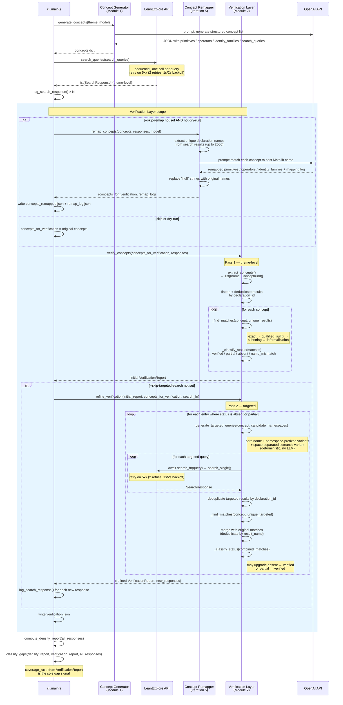
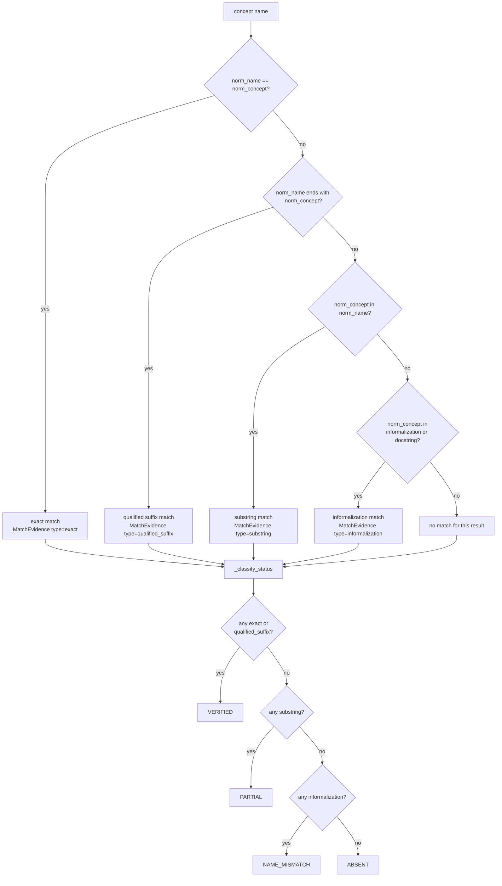
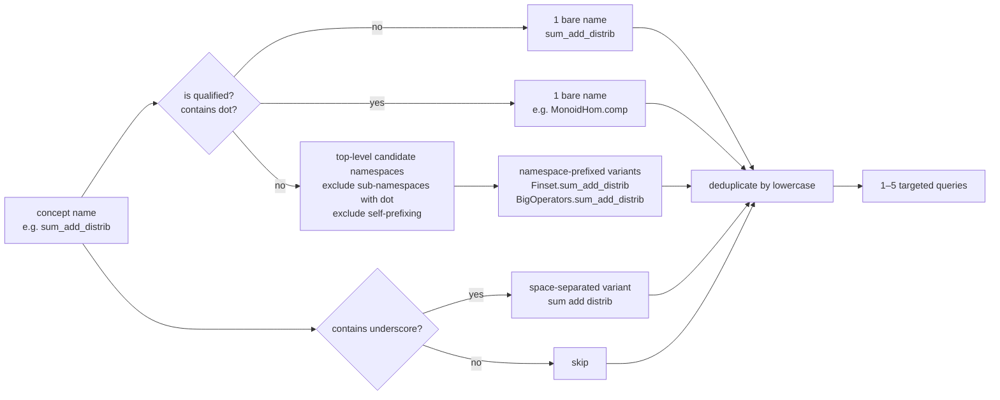
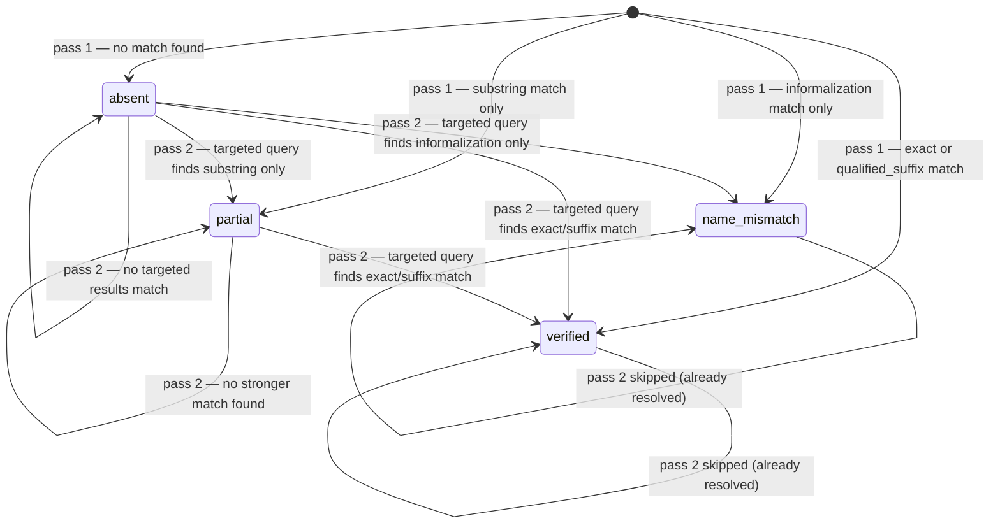

# Verification Layer — Sequence Diagram

*Two-pass verification flow including the Iteration 5 concept re-mapping step.*

The diagram below shows one complete pipeline run from concept generation to the final
`VerificationReport`. The verification layer's scope is the shaded region between
**theme-level search** and **density analysis**.

---

## Full pipeline sequence (verification layer highlighted)



---

## Pass 1 detail: matching heuristics



---

## Pass 2 detail: targeted query generation



---

## Status transitions across passes



---

## Coverage ratio formula

The `coverage_ratio` property on `VerificationReport` is the number consumed by the gap
classifier as its sole gap signal:

```
coverage_ratio = (verified_count + partial_count) / total_count
```

`name_mismatch` counts as found (the concept exists, just under a different name).
`absent` is the only status that reduces coverage.

Gap thresholds (calibrated from Iteration 4 data, 6 themes):

| Coverage | Confidence |
|---|---|
| < 0.3 | `high` gap |
| < 0.5 | `moderate` gap |
| < 0.7 | `low` gap |
| ≥ 0.7 | `well_covered` (no gap) |

If search coverage (fraction of queries returning any results) < 0.7, confidence is downgraded
one tier — API failures make absence unreliable.
