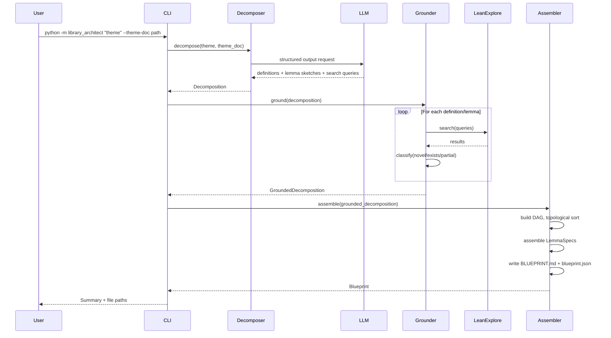

# Library Architect — Design Document

## Status: UPDATED — 2026-02-25

---

## 1. Problem Statement

The Edge Finder (Pillar 1) identifies clusters of absent or under-covered mathematical
concepts in Mathlib — "pocket candidates." The Proof Oracle (Pillar 2) proves individual
lemmas given precise specifications. Between them sits a gap: no system exists to
decompose a mathematical theme into a structured plan of definitions and lemmas that the
Proof Oracle can execute.

Today, the human fills this role by hand-writing lemma specs. This is the bottleneck.
The Library Architect automates it.

**Input:** A mathematical theme (e.g., "Graded Order Combinatorics") and optionally a
theme document describing layers, target concepts, and scope boundaries.

**Output:** A blueprint — a dependency-ordered plan of definitions and lemmas, each with
a complete `LemmaSpec` ready for the Proof Oracle.

### The Grounding Problem (v2 motivation)

The original v1 pipeline (Decompose → Ground → Assemble) had a critical flaw: the LLM
expansion pass generated Lean 4 signatures **from memory** without access to actual
Mathlib source code. This produced four categories of errors that the Proof Oracle
cannot fix (it treats signatures as fixed inputs):

1. **Lean syntax errors** — missing brackets, wrong operators
2. **Mathematical soundness errors** — wrong types, impossible statements
3. **Typeclass/instance errors** — missing or wrong typeclass assumptions (e.g.,
   `[GradeOrder ℕ α]` without `[Preorder α]`)
4. **API name errors** — nonexistent Mathlib names, wrong function signatures

The v2 pipeline closes this grounding loop by feeding Mathlib source text and oracle
exemplars into the expansion prompt.

---

## 2. Goals and Non-Goals

### Goals

1. Given a mathematical theme, produce a coherent mini-library blueprint containing
   10–25 candidate lemmas organized in dependency order.
2. Each blueprint entry must be a complete `LemmaSpec` (lemma name, target file,
   informal statement, suggested Lean 4 signature, dependencies, hints, difficulty).
3. The dependency structure must be a valid DAG — no cycles.
4. The blueprint must be a human-readable, human-editable artifact (markdown + JSON).
5. The system must use LeanExplore to ground its proposals against what actually exists
   in Mathlib, avoiding redundant lemmas where possible.
6. The system must be theme-agnostic — it works for any mathematical pocket, not just
   graded order combinatorics.
7. **Generated signatures must elaborate cleanly** — verified via sorry-elaboration
   against `lake env lean` with `import Mathlib`.

### Non-Goals

1. Executing the blueprint (that is the Library Expander, Pillar 4).
2. Proving any lemmas (that is the Proof Oracle, Pillar 2).
3. Running the Edge Finder to discover pockets (that is Pillar 1).
4. Producing Mathlib-PR-ready code. That is a Pillar 4 concern.

---

## 3. Architecture Overview

### 3.1 Design Philosophy

The Library Architect is a **planning system, not an execution system**. It produces a
static artifact (the blueprint) and then stops. It does not spawn proof sessions, manage
retries, or modify Lean files.

The v2 architecture is built around a key insight: **the LLM must see real Mathlib source
code before writing Lean 4 signatures.** This is achieved by interleaving grounding with
expansion:

1. **Skeleton pass** — LLM generates lightweight names + one-liners (no signatures yet)
2. **Skeleton grounding** — LeanExplore searches, collects `source_text` from Mathlib
3. **Grounded expansion** — LLM expands with Mathlib source snippets + oracle exemplars
4. **Re-grounding** — re-ground expanded items (search queries may differ post-expansion)
5. **Assembly** — DAG sort, LemmaSpec generation, output files
6. **Elaboration check** (optional) — sorry-elaboration via `lake env lean`

### 3.2 Pipeline Architecture

```
Theme doc (markdown)
        │
        ▼
┌──────────────────┐
│   Skeleton Pass  │  ← LLM (GPT-4o): names + one-liners + deps
│   (Stage 1)      │     Output: skeleton JSON (no signatures yet)
└──────┬───────────┘
       │
       ▼
┌──────────────────┐
│   Skeleton       │  ← LeanExplore API: search, collect source_text
│   Grounding      │     Output: GroundedDecomposition with source_snippets
│   (Stage 2)      │
└──────┬───────────┘
       │ Mathlib source snippets
       ▼
┌──────────────────┐
│   Grounded       │  ← LLM (GPT-4o): expand with source context
│   Expansion      │     + oracle exemplar injection
│   (Stage 3)      │     + 10 Lean 4 convention rules
│                  │     Output: Decomposition (grounded signatures)
└──────┬───────────┘
       │
       ▼
┌──────────────────┐
│   Re-Grounding   │  ← LeanExplore API: full grounding of expanded items
│   (Stage 4)      │     Output: GroundedDecomposition (final classification)
└──────┬───────────┘
       │
       ▼
┌──────────────────┐
│   Assembly       │  ← Algorithm: DAG sort + LemmaSpec generation
│   (Stage 5)      │     Output: Blueprint (BLUEPRINT.md + blueprint.json + specs/)
└──────┬───────────┘
       │
       ▼ (optional)
┌──────────────────┐
│   Elaboration    │  ← lake env lean: sorry-check all signatures
│   Checker        │     Output: elaboration_report.json
│   (Stage 6)      │
└──────────────────┘
```

### 3.3 Why Interleave Grounding With Expansion?

The v1 pipeline expanded signatures first, then grounded them. This meant the LLM wrote
Lean 4 code from memory, producing the four error categories listed above. By grounding
the skeleton *before* expansion, we can inject:

1. **Mathlib source snippets** — actual source code of related declarations, showing
   correct typeclass patterns, API naming, and function signatures.
2. **Oracle test exemplars** — proven `.lean` files from `Orion/OracleTests/` that
   demonstrate correct patterns for the mathematical domain.
3. **Explicit convention rules** — 10 detailed Lean 4 rules covering typeclass chains,
   universe-polymorphic type variables, `noncomputable`, `GradeMinOrder` vs `GradeOrder`,
   `Finset` operations, `Polynomial` API, etc.

Result: after the v2.1 manual correction pass and v2.2 extension phase, 19/19 signatures
pass elaboration on the graded order combinatorics theme, with exact matches to all three
oracle test file signatures. The original v2.0 run produced 19 entries (18/18 elaboration),
but manual audit revealed 7 entries with errors that the elaboration checker cannot catch:
mathematically false statements, semantic redundancy, malformed hypotheses, and placeholder
entries. After removing 7 and adding 1 corrected entry (v2.1: 13 entries), 6 natural
extensions were added (v2.2: 19 entries). See `blueprint.json` for details.

---

## 4. Component Breakdown

### 4.1 Decomposer (`decomposer.py`)

**Responsibility:** Given a theme and optional theme document, produce a raw decomposition
of the mathematical content into definitions and lemma sketches.

**Three entry points:**
- `skeleton_pass()` — generates the lightweight skeleton (names + one-liners)
- `expand_with_grounding()` — expands skeleton using grounding context + oracle exemplars
- `decompose()` — legacy single-call decomposition (backward compatible)

**Skeleton pass output:** JSON with `definitions`, `lemmas`, and `layers` arrays.
Each entry has: `name`, `informal`, `depends_on`, `layer`.

**Grounded expansion:**
- Receives the skeleton + `GroundedDecomposition` from skeleton grounding
- Calls `_collect_grounding_context()` to extract Mathlib source snippets per item
- Calls `_find_oracle_exemplars()` to locate `Orion/OracleTests/*.lean` files
- Builds an expansion prompt with grounding context sections injected
- Splits items into batches of 6, each batch gets its own LLM call
- Output: `Decomposition` with full signatures, search queries, hints, difficulty

### 4.2 Grounder (`grounder.py`)

**Responsibility:** Take decomposition entries and check each against Mathlib via
LeanExplore. Two entry points:

- `ground()` — full grounding of a `Decomposition`
- `ground_skeleton()` — lightweight grounding of skeleton JSON (collects `source_text`)

**Key addition in v2:** The `SearchResult` now captures `source_text` from LeanExplore
API responses. The `GroundingResult` model carries `source_snippets: list[dict[str, str]]`
— a list of `{name, source_text}` pairs from related Mathlib declarations. These are
injected into the expansion prompt as grounding context.

### 4.3 Blueprint Assembler (`assembler.py`)

**Responsibility:** Take the grounded decomposition and produce a final blueprint.
Unchanged from v1.

### 4.4 Elaboration Checker (`elaboration_checker.py`)

**Responsibility:** Quality gate that verifies generated Lean 4 signatures elaborate
correctly by wrapping each in a minimal file with `import Mathlib` and a `sorry` body,
then running `lake env lean`.

**Two modes:**
- **Batched (default):** All signatures go into one `.lean` file with separate `section`
  blocks. One `lake env lean` call (~3-4 min for Mathlib import). Errors are attributed
  to individual signatures by line number.
- **Sequential:** One `lake env lean` per signature. Better error isolation but
  ~3-4 min × N signatures. Impractical for 20+ signatures.

**Timeout:** 300 seconds (accommodates slow Mathlib imports).

**Output:** `ElaborationReport` with per-signature pass/fail and error messages.
Written to `elaboration_report.json` in the output directory.

### 4.5 CLI Entry Point (`cli.py`)

**Two pipeline modes:**
- **Default (grounded):** 5-stage pipeline with `--check-signatures` option
- **`--legacy`:** 3-stage pipeline (v1 behavior, no grounding context injection)

**Usage:**
```
python -m library_architect <theme_name> \
    [--theme-doc <path>] \
    [--output-dir <path>] \
    [--check-signatures] \
    [--legacy] \
    [--skip-grounding] \
    [--no-cache] \
    [--clear-cache]
```

### 4.6 Shared Configuration (`config.py`)

**Responsibility:** Output directory defaults, model configuration, LeanExplore settings.

---

## 5. Data Flow

### 5.1 End-to-End Flow (v2 Grounded Pipeline)

```
Theme name + theme doc (optional)
        │
        ▼
┌──────────────┐
│  Skeleton    │  LLM call: theme → names + one-liners + deps
│  Pass        │  (no signatures yet — just the plan)
└──────┬───────┘
       │ Skeleton JSON
       ▼
┌──────────────┐
│  Skeleton    │  LeanExplore: search queries from skeleton
│  Grounding   │  Collects source_text per result
└──────┬───────┘
       │ GroundedDecomposition + source_snippets
       ▼
┌──────────────┐
│  Grounded    │  LLM call: expand with Mathlib source context
│  Expansion   │  + oracle exemplars + convention rules
└──────┬───────┘
       │ Decomposition (with grounded signatures)
       ▼
┌──────────────┐
│  Re-Ground   │  LeanExplore: re-ground with new search queries
└──────┬───────┘
       │ GroundedDecomposition (final)
       ▼
┌──────────────┐
│  Assembly    │  DAG sort + LemmaSpec + BLUEPRINT.md + blueprint.json
└──────┬───────┘
       │
       ▼ (optional)
┌──────────────┐
│  Elaboration │  lake env lean: verify all signatures
│  Check       │  → elaboration_report.json
└──────────────┘
```

### 5.2 LLM Usage

| Component | Model | Purpose | Estimated Cost |
|-----------|-------|---------|----------------|
| Skeleton Pass | gpt-4o | Names + one-liners | ~$0.01–0.03 |
| Grounded Expansion | gpt-4o | Full signatures with context | ~$0.05–0.15 |
| Grounder | None (API) | LeanExplore search | Free |
| Assembler | None (algo) | DAG + spec assembly | Free |
| Elaboration Check | None | lake env lean | Free (local) |

Total estimated cost per blueprint: **~$0.06–0.18**.

### 5.3 Downstream Interface

The `blueprint.json` contains an ordered list of `BlueprintEntry` objects. Each entry
with `status: "planned"` contains a complete `LemmaSpec` matching the schema consumed by
`proof_oracle.runner.orchestrator.run_lemma()`.

---

## 6. Key Design Decisions

| Decision | Choice | Rationale |
|----------|--------|-----------|
| Interleave grounding with expansion? | Yes | The LLM must see real Mathlib source code before writing signatures. This eliminated all four error categories. |
| Oracle exemplar injection? | Yes | Proven test files demonstrate correct patterns. The LLM produces exact-match signatures when it can see working examples. |
| Batched elaboration check? | Yes (default) | Amortizes ~3-4 min Mathlib import cost across all signatures. One import instead of N. |
| Two LLM passes? | Yes | Pass 1 for lightweight planning (overcomes output length self-limiting), Pass 2 for detailed expansion with grounding context. |
| LLM for grounding? | No | Grounding is search + classification — deterministic and reproducible. |
| Blueprint format? | Markdown + JSON dual output | Markdown for human review/editing, JSON for machine consumption. |
| Theme-agnostic? | Yes | No component hard-codes mathematical domain knowledge. |

---

## 7. Alternatives Considered

### 7.1 Upgrade the LLM Instead of Closing the Grounding Loop

We could use a more capable model (GPT-4.5, Claude Opus) hoping it "knows" Mathlib
better.

**Rejected because:** The problem is not LLM capability — it's information access. Even
the best model cannot produce correct typeclass chains for Lean 4 declarations it hasn't
seen. Feeding real source text is strictly better than hoping for memorization.

### 7.2 Fix Signatures in the Proof Oracle

The Proof Oracle could be modified to fix broken signatures before proving.

**Rejected because:** The Proof Oracle's design treats signatures as **fixed inputs**.
Modifying this contract adds complexity and removes the clean separation between
planning (Architect) and execution (Oracle). All four error categories are fatal and
must be fixed at the source.

### 7.3 Skip the Grounder — Let the Proof Oracle Discover Redundancy

**Rejected because:** Each Proof Oracle invocation costs $0.50–2.00 and takes minutes.
Grounding via LeanExplore costs nothing and takes seconds.

---

## 8. Known Risks and Failure Modes

### R1: LeanExplore Downtime (Low Likelihood, High Impact)

LeanExplore has observed transient failures (HTTP 5xx). Some searches consistently fail.

**Mitigation:** Retry with exponential backoff. Per-query error isolation. Fall back to
`ungrounded` status with warning. The pipeline continues even if some queries fail.

### R2: Grounding Misclassification (Medium Likelihood, Medium Impact)

LeanExplore may return results that look like a match but aren't semantically equivalent.

**Mitigation:** The `partial_overlap` category provides a middle ground. Human review of
`BLUEPRINT.md` catches misclassifications. `grounding_evidence` records what was found.

### R3: Elaboration Timeout (Low Likelihood, Medium Impact)

Batched elaboration takes ~3-4 minutes. If Mathlib imports are slow or the machine is
under load, the 300s timeout may be insufficient.

**Mitigation:** Timeout is configurable. Sequential mode available as fallback.

### R4: Oracle Exemplars Not Available for New Themes

The oracle exemplar injection depends on `Orion/OracleTests/*.lean` files. For themes
without proven exemplars, the expansion prompt lacks this grounding signal.

**Mitigation:** The convention rules and Mathlib source snippets provide grounding even
without exemplars. Exemplars are a bonus, not a requirement.

---

## 9. Critical Invariants

1. **The blueprint must be a valid DAG.** Enforced by topological sort.
2. **Every `planned` entry must have a complete `LemmaSpec`.**
3. **Every grounding classification must cite evidence.**
4. **The expansion prompt must include Mathlib source snippets when available.**
5. **The elaboration checker must not modify signatures.** It reports, not fixes.
6. **Theme-agnosticism.** No component hard-codes mathematical domain knowledge.

---

## 10. Results (Graded Order Combinatorics)

### v2.0 (automated pipeline output)

The v2 pipeline on the `graded_order_combinatorics` theme initially produced:

- **19 entries:** 3 definitions + 16 lemmas
- **18 planned, 1 exists in Mathlib** (`level` → `Erdos1043.levelSet`)
- **18/18 signatures pass elaboration** (0 failures)
- **Exact signature matches** to all 3 oracle test files

### v2.1 (after manual correction pass)

Manual audit of all 19 entries revealed 7 with errors that the elaboration checker
cannot detect (syntactic correctness ≠ mathematical correctness):

- **4 removed:** `level_monotonicity` (mathematically false), `level_covering` (type
  error: `Set.iUnion` vs `Finset`), `rankGenPoly_simp` (empty placeholder),
  `saturatedChain_length_eq` (redundant, uses unsafe ℕ subtraction)
- **3 removed (malformed):** `saturatedChain` def (unbound `hne`), `maximalChain_in_saturated`
  (meaningless hypothesis), `maximalChain_length_const` (too-weak `Chain' (≤)`)
- **1 added:** `saturatedChain_length_const` (corrected replacement)
- **1 renamed:** `rankGenPoly_degree` → `rankGenPoly_natDegree` (uses `ℕ` not `WithBot ℕ`)

After correction:

- **13 entries:** 2 definitions + 11 lemmas
- **12 planned, 1 exists in Mathlib** (`level`)
- **13/13 signatures pass elaboration** (verified via `BlueprintV21.lean`)
- **Exact signature matches** to all 3 oracle test files:
  - `levelCard_sum` — exact match (typeclass chain, sum range, `Finset.card_eq_sum_card_image`)
  - `rankGenPoly` + `rankGenPoly_eval_one` — exact match (modulo `level` abbreviation)
  - `saturatedChain_length` — exact match (correctly uses `GradeMinOrder`, not `GradeOrder`)

### v2.2 (extensions)

6 natural extensions added to restore the blueprint to 19 entries with correct, audited content:

- **Layer 2 additions (2):** `rankGenPoly_eval_zero` (eval at 0 = |level 0|),
  `rankGenPoly_coeff_eq_zero` (empty level → zero coefficient, key helper for `rankGenPoly_natDegree`)
- **Layer 3 additions (4):** `grade_le_of_chain` (ℕ subtraction guard),
  `saturatedChain_length_grade_diff` (combinatorially natural form: length = grade diff + 1),
  `saturatedChain_grade_strictMono` (grades strictly increase along covering chain),
  `saturatedChain_nodup` (element distinctness, corollary of strict monotonicity)

After extension:

- **19 entries:** 2 definitions + 17 lemmas
- **18 planned, 1 exists in Mathlib** (`level`)
- **19/19 signatures pass elaboration** (verified via `BlueprintV22.lean`)
- **No Mathlib overlap** for any of the 6 new entries (verified via LeanExplore)
- **Exact signature matches** to all 3 oracle test files (unchanged)

**Key lesson:** The elaboration checker catches syntax/typeclass errors but not mathematical
incorrectness, semantic redundancy, or meaningless hypotheses. Manual audit remains essential
for blueprint quality. This should inform the design of automated quality checks in the
Library Expander.

---

## 11. Directory Structure

```
library_architect/
├── __init__.py
├── __main__.py
├── cli.py                           # CLI entry point (grounded + legacy modes)
├── config.py                        # Shared configuration
├── models.py                        # Data models (Decomposition, Blueprint, etc.)
├── decomposer.py                    # LLM decomposition (skeleton + grounded expansion)
├── grounder.py                      # LeanExplore grounding (with source_text capture)
├── assembler.py                     # DAG validation + blueprint generation
├── elaboration_checker.py           # Sorry-elaboration quality gate
├── prompts/
│   ├── decomposer_prompt.md         # (legacy) single-pass prompt
│   ├── decomposer_skeleton_prompt.md # Skeleton generation prompt
│   └── decomposer_expand_prompt.md  # Grounded expansion prompt (10 convention rules)
├── themes/
│   └── graded_order_combinatorics.md
├── docs/
│   ├── library_architect_design.md  # This document
│   └── LIBRARY_ARCHITECT_WALKTHROUGH.md
├── .cache/                          # Disk cache (not version controlled)
└── runs/                            # Generated output
    └── graded_order_combinatorics/
        ├── BLUEPRINT.md
        ├── blueprint.json
        ├── elaboration_report.json
        └── lemma_specs/
```
┌─────────────────────────────────────────────────────────────┐
│                     Library Architect                       │
│                                                             │
│  ┌──────────────┐    ┌──────────────┐    ┌───────────────┐  │
│  │  Decomposer  │───▶│   Grounder   │───▶│  Blueprint    │  │
│  │   (LLM)      │    │ (LeanExplore │    │  Assembler    │  │
│  │              │    │  + DAG logic)│    │  (LLM + algo) │  │
│  └──────────────┘    └──────────────┘    └───────────────┘  │
│         │                                       │           │
│         ▼                                       ▼           │
│   Raw decomposition                       BLUEPRINT.md      │
│   (definitions +                          blueprint.json    │
│    lemma sketches)                                          │
└─────────────────────────────────────────────────────────────┘
         ▲                                       │
         │                                       ▼
   Theme document                         Library Expander
   (input)                                (Pillar 4, future)
                                               │
                                          Proof Oracle
                                          (Pillar 2)
```

### 3.3 Why Not a Single LLM Call?

A single "plan the whole library" LLM call would be the simplest design. We reject it
because:

- **Grounding matters.** Without checking LeanExplore, the LLM will propose lemmas that
  already exist in Mathlib (the same false-absence problem the Edge Finder solved).
- **DAG validity matters.** The LLM may produce circular dependencies or reference
  definitions it hasn't defined yet. Algorithmic validation catches this.
- **Iterability matters.** If the human wants to adjust scope, a monolithic plan must be
  regenerated entirely. With decomposition separated from assembly, the human can edit
  the raw decomposition and re-run assembly cheaply.

---

## 4. Component Breakdown

### 4.1 Decomposer (`decomposer.py`, estimated ~200 lines)

**Responsibility:** Given a theme and optional theme document, produce a raw decomposition
of the mathematical content into definitions and lemma sketches.

**Input:**
- `theme: str` — the theme name (e.g., "Graded Order Combinatorics")
- `theme_doc: str | None` — optional markdown document describing the theme's layers,
  scope, and target concepts (e.g., `graded_order_combinatorics.md`)

**Output:** `Decomposition` — a structured object containing:
- `definitions: list[DefinitionSketch]` — proposed Lean definitions
  - `name: str` — proposed Lean name (e.g., `GradedPoset.level`)
  - `informal: str` — what this definition captures
  - `suggested_signature: str` — proposed Lean 4 signature
  - `layer: str` — which theme layer this belongs to
  - `mathlib_search_queries: list[str]` — queries to check if this already exists
- `lemmas: list[LemmaSketch]` — proposed lemmas about those definitions
  - `name: str` — proposed Lean name
  - `informal_statement: str` — natural language statement
  - `suggested_signature: str` — proposed Lean 4 signature
  - `depends_on: list[str]` — names of definitions/lemmas this requires
  - `layer: str` — which theme layer this belongs to
  - `hints: str` — suggested proof approach
  - `difficulty: str` — estimated difficulty (easy / medium / hard)
  - `mathlib_search_queries: list[str]` — queries to check if this already exists

**Implementation:** Single LLM call (OpenAI gpt-4o or Anthropic Claude Sonnet) with a
structured JSON output schema. The prompt includes the theme document (if provided) and
instructs the LLM to:
1. Identify the definitions needed (types, operators, predicates).
2. Identify lemmas about those definitions (properties, identities, conversions).
3. For each, propose a Lean 4 signature using standard Mathlib conventions.
4. For each, suggest 2–3 LeanExplore search queries to check for existing coverage.
5. Organize by layer if the theme document specifies layers.

**What this component does NOT do:** It does not check whether proposals exist in
Mathlib. It does not validate the DAG. It produces hypotheses, not claims — the same
epistemological discipline as the Edge Finder's concept generator.

### 4.2 Grounder (`grounder.py`, estimated ~250 lines)

**Responsibility:** Take the raw decomposition and check each proposal against Mathlib
via LeanExplore. Classify each as `novel`, `exists`, or `partial_overlap`. Remove or
flag entries that are redundant.

**Input:** `Decomposition` (from the Decomposer)

**Output:** `GroundedDecomposition` — the same structure with added fields:
- Each definition/lemma gains:
  - `grounding_status: str` — `"novel"`, `"exists"`, or `"partial_overlap"`
  - `grounding_evidence: list[str]` — relevant Mathlib declaration names found
  - `grounding_notes: str` — human-readable explanation of the classification

**Implementation:**
1. For each definition/lemma, run its `mathlib_search_queries` against LeanExplore.
2. Classify based on search results:
   - `exists` — a declaration with matching semantics was found.
   - `partial_overlap` — related declarations exist but do not cover the exact statement.
   - `novel` — no relevant declarations found.
3. For `exists` entries, record the Mathlib declaration name so the blueprint can
   reference it as a dependency rather than re-proving it.

**Key invariant:** Every search query must be logged (same discipline as Edge Finder).
Classification decisions must include evidence.

### 4.3 Blueprint Assembler (`assembler.py`, estimated ~300 lines)

**Responsibility:** Take the grounded decomposition and produce a final blueprint — a
dependency-ordered plan with complete `LemmaSpec` entries.

**Input:** `GroundedDecomposition` (from the Grounder)

**Output:**
- `Blueprint` — a structured object containing:
  - `theme: str`
  - `entries: list[BlueprintEntry]` — in topological (dependency) order
  - `dependency_dag: dict[str, list[str]]` — adjacency list
  - `summary: BlueprintSummary` — counts, layer breakdown, risk assessment
- Serialized to two files:
  - `BLUEPRINT.md` — human-readable, editable plan
  - `blueprint.json` — machine-readable, consumed by the Library Expander

Each `BlueprintEntry` contains:
- `name: str`
- `entry_type: str` — `"definition"` or `"lemma"`
- `status: str` — `"planned"`, `"exists_in_mathlib"`, `"skipped"`
- `layer: str`
- `lemma_spec: LemmaSpec | None` — complete spec for `planned` entries; `None` for
  `exists_in_mathlib` entries
- `grounding_status: str`
- `grounding_evidence: list[str]`
- `mathlib_reference: str | None` — if the entry exists in Mathlib, its declaration name
- `order_index: int` — position in topological sort

**Implementation:**
1. Build the dependency graph from `depends_on` fields.
2. Validate acyclicity (topological sort; fail loudly if cycles detected).
3. For `exists` entries, mark as `exists_in_mathlib` and replace downstream `depends_on`
   references with the actual Mathlib declaration name.
4. For `novel` and `partial_overlap` entries, assemble a complete `LemmaSpec`:
   - `target_file` — derived from theme name and layer
     (e.g., `Orion/GradedOrderCombinatorics/LevelSets.lean`)
   - `target_namespace` — derived from target file
   - Remaining fields copied from the grounded decomposition
5. Topologically sort all entries. Entries whose dependencies are all `exists_in_mathlib`
   come first (they are "leaves" with no upstream work).
6. Generate `BLUEPRINT.md` and `blueprint.json`.

### 4.4 CLI Entry Point (`cli.py`, estimated ~80 lines)

**Responsibility:** Command-line interface for running the Library Architect.

**Usage:**
```
python -m library_architect <theme_name> [--theme-doc <path>] [--output-dir <path>]
```

**Behavior:**
1. Load theme document if provided.
2. Run Decomposer → Grounder → Blueprint Assembler.
3. Write `BLUEPRINT.md` and `blueprint.json` to the output directory.
4. Print summary to stdout.

### 4.5 Shared Configuration (`config.py`, estimated ~30 lines)

**Responsibility:** Output directory defaults, model configuration, LeanExplore settings.

---

## 5. Data Flow

### 5.1 End-to-End Flow

```
Theme name + theme doc (optional)
        │
        ▼
┌──────────────┐
│  Decomposer  │  LLM call: theme → raw definitions + lemma sketches
│              │  + search queries for each proposal
└──────┬───────┘
       │ Decomposition
       ▼
┌──────────────┐
│   Grounder   │  LeanExplore: run search queries
│              │  Classify each proposal: novel / exists / partial_overlap
└──────┬───────┘
       │ GroundedDecomposition
       ▼
┌──────────────┐
│  Blueprint   │  DAG construction + topological sort
│  Assembler   │  LemmaSpec assembly for novel entries
│              │  BLUEPRINT.md + blueprint.json generation
└──────┬───────┘
       │
       ▼
BLUEPRINT.md   blueprint.json
(human review)  (machine consumption by Library Expander)
```

### 5.2 LLM Usage

| Component | Model | Purpose | Estimated Cost |
|-----------|-------|---------|----------------|
| Decomposer | gpt-4o / claude-sonnet | Mathematical decomposition | ~$0.05–0.15 per run |
| Grounder | None (API only) | LeanExplore search | Free (API calls) |
| Assembler | None (algorithmic) | DAG + spec assembly | Free |

Total estimated cost per blueprint: **~$0.05–0.15**.

### 5.3 Downstream Interface

The `blueprint.json` contains an ordered list of `BlueprintEntry` objects. Each entry
with `status: "planned"` contains a complete `LemmaSpec` matching the schema consumed by
`proof_oracle.runner.orchestrator.run_lemma()`:

```json
{
  "lemma_name": "level_disjoint",
  "target_file": "Orion/GradedOrderCombinatorics/LevelSets.lean",
  "target_namespace": "Orion.GradedOrderCombinatorics.LevelSets",
  "informal_statement": "Level sets at different grades are disjoint: if j ≠ k, then level j ∩ level k = ∅.",
  "suggested_signature": "theorem level_disjoint [Fintype α] [DecidableEq α] [Preorder α] [GradeOrder ℕ α] {j k : ℕ} (hjk : j ≠ k) : level j ∩ level k = ∅",
  "depends_on": ["level"],
  "hints": "Unfold level; use Finset.filter_inter_filter_neg_eq or ext with Finset.mem_filter.",
  "attempt_budget": 10,
  "difficulty": "easy"
}
```

---

## 6. BLUEPRINT.md Format

The blueprint is the single source of truth for the planned mini-library. It must be
human-readable, human-editable, and git-diffable. Format:

```markdown
# Blueprint: Graded Order Combinatorics

Generated: 2026-02-25T12:00:00Z
Theme document: library_architect/themes/graded_order_combinatorics.md

## Summary

- Definitions: 3 planned, 0 exist in Mathlib
- Lemmas: 12 planned, 2 exist in Mathlib, 1 skipped
- Layers: 3 (Level Sets, Rank Generating Functions, Saturated Chains)
- Total entries: 18

## Dependency Graph

level → level_disjoint
level → level_cover_univ
level → level_card_sum
level → rankGenPoly
rankGenPoly → rankGenPoly_eval_one
rankGenPoly → rankGenPoly_coeff
...

## Layer 1: Level Sets

### DEF level
- status: planned
- signature: `def level [Fintype α] ... : Finset α := ...`
- informal: The set of elements at grade k.
- grounding: novel (no match in Mathlib)
- depends_on: (none)

### LEMMA level_disjoint
- status: planned
- signature: `theorem level_disjoint ... : level j ∩ level k = ∅`
- informal: Level sets at different grades are disjoint.
- grounding: novel
- depends_on: level
- hints: Unfold level; use Finset.filter properties.
- difficulty: easy

...
```

---

## 7. Key Design Decisions

| Decision | Choice | Rationale |
|----------|--------|-----------|
| LLM for decomposition? | Yes | Mathematical judgment about what definitions and lemmas to write cannot be done algorithmically. |
| LLM for grounding? | No | Grounding is search + classification — deterministic and reproducible. Same discipline as Edge Finder. |
| LLM for DAG construction? | No | Topological sort is algorithmic. LLM-produced `depends_on` fields are the input. |
| Single LLM call or multi-turn? | Single call for decomposition | The theme doc provides enough context. Multi-turn adds latency and cost without clear benefit. Can be revisited if decomposition quality is poor. |
| Blueprint format? | Markdown + JSON dual output | Markdown for human review/editing, JSON for machine consumption. Same pattern as Proof Oracle's MANIFEST.md. |
| Target file paths? | Derived from theme + layer | `Orion/<ThemePascalCase>/<LayerPascalCase>.lean`. Consistent, predictable. |
| Theme-agnostic? | Yes | The Decomposer prompt does not hard-code any mathematical domain. The theme document is the only domain-specific input. |

---

## 8. Alternatives Considered

### 8.1 Skip the Grounder — Let the Proof Oracle Discover Redundancy

The Proof Oracle will discover if a lemma already exists (trivial/circular proofs). We
could skip grounding and let the Expander handle it.

**Rejected because:** Each Proof Oracle invocation costs $0.50–2.00 and takes minutes.
Grounding via LeanExplore costs nothing and takes seconds. Filtering redundant proposals
upfront saves significant time and money downstream.

### 8.2 Use the Edge Finder's Candidate Report as Input

The Edge Finder produces `ScoredCandidate` objects with concept clusters. We could
require this as input instead of a theme document.

**Rejected because:** The Edge Finder's output is structural (namespace clusters, gap
scores) but lacks mathematical content — it says "concepts X, Y, Z are absent" but not
"here are the definitions and lemmas that would fill the gap." The Library Architect
needs mathematical reasoning that the Edge Finder does not provide. However, a
`ScoredCandidate` can certainly *inform* a theme document written by a human.

### 8.3 Multi-Agent Decomposition (Numina-Style)

Use a coordinator + blueprint agent + sketch agent architecture for planning.

**Rejected because:** This is a planning task, not a proving task. The Numina-style
multi-agent design adds complexity justified for proof search (where tool use and
iterative refinement are essential) but not for structured output generation. A single
well-prompted LLM call with structured output schema is sufficient for the decomposition
step.

---

## 9. Known Risks and Failure Modes

### R1: LLM Proposes Invalid Lean 4 Signatures (High Likelihood, Medium Impact)

The Decomposer's suggested signatures may not type-check. This is expected and
acceptable — the Proof Oracle's task template instructs the agent to write the signature
with `sorry` and check diagnostics before proving. Minor signature issues are corrected
by the proof agent.

**Mitigation:** The `hints` field can include notes like "signature may need adjustment —
check typeclass requirements." The Proof Oracle has an existing retry loop.

### R2: Grounding Misclassifies a Novel Lemma as Existing (Medium Likelihood, High Impact)

If LeanExplore returns a result that looks like a match but isn't semantically equivalent,
the Grounder may skip a lemma that should be proved.

**Mitigation:** The `grounding_evidence` field records what was found. Human review of
`BLUEPRINT.md` can catch misclassifications. The `partial_overlap` category provides a
middle ground — the human decides whether to include or skip.

### R3: Dependency DAG is Wrong (Medium Likelihood, Medium Impact)

The LLM may list incorrect dependencies (missing a required definition, or listing an
unnecessary one).

**Mitigation:** Topological sort will catch cycles. Missing dependencies will surface
when the Proof Oracle hits `END_REASON:ERROR` because a required definition doesn't
exist. The Library Expander (Pillar 4) will need to handle this — it's a runtime concern,
not a planning concern.

### R4: Decomposition is Too Shallow or Too Deep (Medium Likelihood, Low Impact)

The LLM may produce too few lemmas (missing important properties) or too many (including
trivial variations that bloat the library).

**Mitigation:** Human review of `BLUEPRINT.md` before execution. The theme document
can include scope guidance ("10–20 lemmas", "focus on level sets and rank generating
functions, not advanced chain theory").

### R5: LeanExplore Downtime During Grounding (Low Likelihood, High Impact)

LeanExplore has observed transient failures (HTTP 5xx).

**Mitigation:** Retry with exponential backoff, same pattern as Edge Finder's
`leanexplore.py`. Fall back to `grounding_status: "ungrounded"` if all retries fail,
with a warning in the blueprint.

---

## 10. Critical Invariants

1. **The blueprint must be a valid DAG.** The Assembler must reject any decomposition
   with circular dependencies. This is enforced by topological sort — failure to sort
   is a hard error.

2. **Every `planned` entry must have a complete `LemmaSpec`.** No partial specs. If a
   field cannot be determined, the entry should be marked `skipped` with a reason.

3. **Every grounding classification must cite evidence.** A `novel` classification means
   "searched N queries, found 0 relevant results." An `exists` classification means
   "found declaration X in module Y." No classification without evidence.

4. **The Decomposer produces hypotheses, not claims.** Same epistemological discipline as
   the Edge Finder's concept generator. The Grounder checks reality.

5. **The blueprint is a static artifact.** The Library Architect does not modify it after
   generation. Modifications are made by the human (manual edits) or the Library Expander
   (status updates during execution).

6. **Theme-agnosticism.** No component may hard-code mathematical domain knowledge. All
   domain specificity comes from the theme name and theme document inputs.

---

## 11. Implementation Plan

### Phase 1: Core Pipeline (This PR)

1. Data models (`models.py`) — `DefinitionSketch`, `LemmaSketch`, `Decomposition`,
   `GroundedDecomposition`, `BlueprintEntry`, `Blueprint`.
2. Decomposer (`decomposer.py`) — LLM-based theme decomposition.
3. Grounder (`grounder.py`) — LeanExplore-based grounding.
4. Blueprint Assembler (`assembler.py`) — DAG validation, LemmaSpec assembly,
   BLUEPRINT.md + blueprint.json generation.
5. CLI (`cli.py`) — entry point.
6. Configuration (`config.py`) — defaults.
7. Prompts (`prompts/decomposer_prompt.md`) — decomposition prompt template.

### Phase 2: Iteration and Refinement (Future)

- Multi-turn decomposition for complex themes.
- Automated blueprint quality scoring.
- Integration with Edge Finder's `CandidateReport` as supplementary input.
- Blueprint diff tool for comparing runs.

---

## 12. Sequence Diagram



---

## 13. Directory Structure

```
library_architect/
├── __init__.py
├── __main__.py
├── cli.py                    # CLI entry point
├── config.py                 # Shared configuration
├── models.py                 # Data models (Decomposition, Blueprint, etc.)
├── decomposer.py             # LLM-based theme decomposition
├── grounder.py               # LeanExplore-based grounding
├── assembler.py              # DAG validation + blueprint generation
├── prompts/
│   └── decomposer_prompt.md  # Decomposition prompt template
├── themes/                   # Theme documents (input)
│   └── graded_order_combinatorics.md
└── docs/
    └── library_architect_design.md  # This document
```
