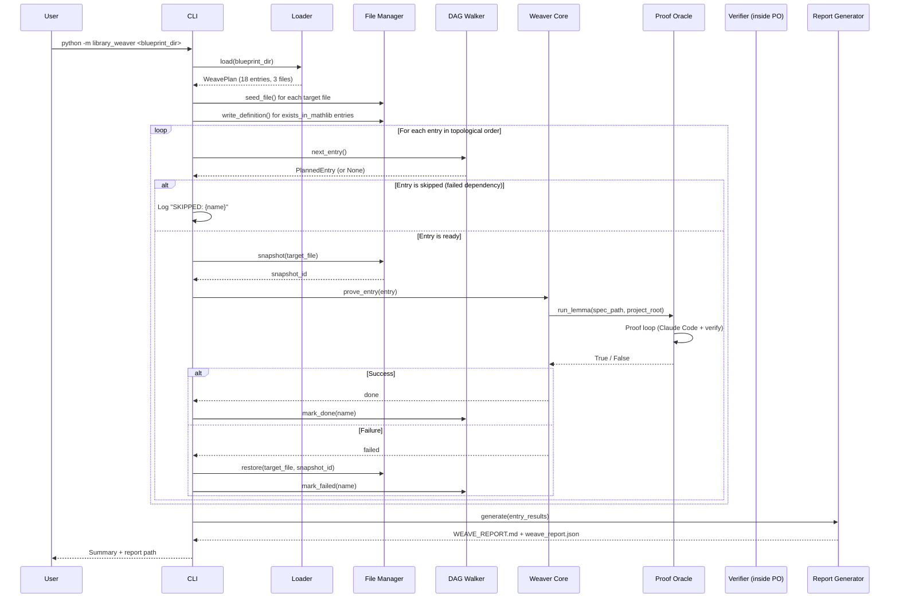

# Library Weaver — Design Document

## Status: DRAFT v2 — 2026-02-25 (updated: exception handling, SIGINT, manifest_path)

---

## 1. Problem Statement

Project Orion has three working pillars:

1. **Edge Finder** — identifies underdeveloped pockets in Mathlib.
2. **Library Architect** — decomposes a mathematical theme into a blueprint: a dependency-ordered plan of definitions and lemmas, each with a complete `LemmaSpec`.
3. **Proof Oracle** — proves a single lemma given a `LemmaSpec`, producing a verified `.lean` file.

The gap: no system exists to **execute a blueprint end-to-end**. The Library Architect produces 18 specs; the Proof Oracle proves one at a time. Between them sits a coordination problem:

- Lemmas must be proved in dependency order.
- Multiple lemmas share a target file — earlier definitions and proofs must be present when later lemmas are attempted.
- If a lemma fails, its dependents may need to be skipped.
- Progress must be tracked across the entire run, not just per-lemma.

Today, the human fills this role: manually invoking `run_lemma()` 18 times in the right order, copying proven code into the right files, and deciding what to do when something fails.

**The Library Weaver automates this.** It reads a blueprint, walks the dependency DAG in topological order, manages Lean file accumulation, invokes the Proof Oracle for each entry, and produces a complete verified Lean 4 library (or a partial library with clear failure reporting).

---

## 2. Goals and Non-Goals

### Goals

1. Read `blueprint.json` and execute all `planned` entries in dependency order.
2. For each entry, invoke `proof_oracle.runner.orchestrator.run_lemma()` programmatically.
3. **Manage Lean file accumulation** — ensure that when the Proof Oracle writes lemma N to `LevelSets.lean`, lemmas 1..N-1 that share that file are already present so downstream references resolve.
4. Track run-level progress: which entries succeeded, failed, were skipped, and why.
5. Handle failures gracefully: if entry X fails, skip all entries that transitively depend on X.
6. Produce a run report (markdown + JSON) summarizing results, costs, and timing.
7. Be theme-agnostic — work for any blueprint, not just Graded Order Combinatorics.
8. Provide a CLI entry point for human operation.

### Non-Goals

1. **Proving lemmas.** That is the Proof Oracle's job. Library Weaver only orchestrates.
2. **Generating blueprints.** That is the Library Architect's job.
3. **Submitting PRs to Mathlib.** That is the future Proof Foundry (Pillar 5).
4. **Retrying the Proof Oracle's internal attempts.** The Oracle manages its own attempt budget. Library Weaver treats `run_lemma()` as an atomic operation that returns `bool`.
5. **Parallel proof execution.** Phase 1 processes entries sequentially. The DAG structure makes parallelism a natural future extension, but it adds complexity (concurrent file writes, partial dependency satisfaction) that is not justified until the sequential pipeline is validated.
6. **Modifying blueprint entries.** Library Weaver executes a blueprint as-is. It does not adjust signatures, hints, or budgets. If the human wants to change a spec, they edit the blueprint and re-run.

---

## 3. Architecture Overview

### 3.1 Design Philosophy

Library Weaver is an **orchestration layer**, not a reasoning system. It reads a static plan (the blueprint), executes it step by step (via the Proof Oracle), and records results. There is no LLM in the loop. Every decision is deterministic:

- **What to prove next?** The topological sort in `blueprint.json` determines order.
- **Should this entry be skipped?** Yes, if any of its internal dependencies failed.
- **Where does the proof go?** The `target_file` in the `LemmaSpec` determines the file.
- **Did the proof succeed?** `run_lemma()` returns `True` or `False`.

This follows the same principle as the Proof Oracle's orchestrator: **Python determinism is a feature.** Putting an LLM in the orchestration loop would add latency, cost, and a new failure mode with zero benefit.

### 3.2 System Architecture

```
Human Operator
  │
  │  python -m library_weaver <blueprint_dir>
  ▼
┌─────────────────────────────────────────────────────────────┐
│                      Library Weaver                         │
│                                                             │
│  ┌──────────────┐   ┌──────────────┐   ┌────────────────┐  │
│  │  Blueprint    │──▶│    DAG       │──▶│  Proof Loop    │  │
│  │  Loader       │   │  Walker      │   │  (per entry)   │  │
│  └──────────────┘   └──────────────┘   └───────┬────────┘  │
│                                                 │           │
│  ┌──────────────┐   ┌──────────────┐           │           │
│  │  File        │◀──│  Proof Oracle│◀──────────┘           │
│  │  Manager     │   │  (run_lemma) │                       │
│  └──────────────┘   └──────────────┘                       │
│         │                                                   │
│         ▼                                                   │
│  ┌──────────────┐                                           │
│  │  Run Report  │                                           │
│  │  Generator   │                                           │
│  └──────────────┘                                           │
└─────────────────────────────────────────────────────────────┘
         │                              │
         ▼                              ▼
  Orion/<Theme>/*.lean           library_weaver/runs/<run_id>/
  (verified library)             (report + logs)
```

### 3.3 Component Inventory

| Component | Module | Responsibility |
|-----------|--------|----------------|
| Blueprint Loader | `loader.py` | Parse `blueprint.json`, extract planned entries, reconstruct the dependency DAG |
| DAG Walker | `dag.py` | Topological traversal with skip-on-failure propagation |
| File Manager | `file_manager.py` | Manage Lean file accumulation: seed files, track what's been written |
| Proof Loop | `weaver.py` | Per-entry orchestration: prepare spec, invoke Oracle, record result |
| Run Report | `report.py` | Generate run summary (markdown + JSON) |
| CLI | `cli.py` | Entry point, argument parsing, progress display |
| Models | `models.py` | Data classes for weaver-specific state |

---

## 4. Data Flow

### 4.1 End-to-End Flow

```
blueprint.json (from Library Architect)
       │
       ▼
┌──────────────┐
│  Blueprint   │  Parse entries, extract planned items,
│  Loader      │  reconstruct dependency DAG
└──────┬───────┘
       │ list[PlannedEntry], DAG
       ▼
┌──────────────┐
│  File        │  Create/seed target .lean files with
│  Manager     │  import headers and namespace blocks.
│  (seed)      │  Write the `level` definition (exists_in_mathlib).
└──────┬───────┘
       │
       ▼
┌──────────────────────────────────────────────┐
│  DAG Walker — process entries in topo order   │
│                                               │
│  For each entry:                              │
│    1. Check: are all internal deps satisfied? │
│       If not → mark SKIPPED, continue         │
│                                               │
│    2. File Manager: write lemma spec file     │
│       to a temp location for the Oracle       │
│                                               │
│    3. Invoke run_lemma(spec_path)             │
│       Oracle writes proof to target_file      │
│                                               │
│    4. If success:                             │
│         Mark DONE, record in File Manager     │
│       If failure:                             │
│         Mark FAILED                           │
│         File Manager: restore target file     │
│         to pre-attempt state                  │
│                                               │
│    5. Update run report                       │
└──────────────────────────────────────────────┘
       │
       ▼
┌──────────────┐
│  Run Report  │  Write WEAVE_REPORT.md + weave_report.json
│  Generator   │  Summary: N/M proved, cost, timing, failures
└──────────────┘
```

### 4.2 Input: Blueprint Directory

Library Weaver takes the Library Architect's output directory as input. It expects:

```
library_architect/runs/<theme>/
├── blueprint.json          # Required — the blueprint
├── BLUEPRINT.md            # Optional — human reference
├── elaboration_report.json # Optional — elaboration results
└── lemma_specs/            # Required — individual spec files
    ├── level_mem_iff.json
    ├── level_disjoint.json
    └── ...
```

The `lemma_specs/` directory contains one JSON file per planned entry, in the format consumed by `proof_oracle.runner.orchestrator.run_lemma()`.

### 4.3 Output: Run Directory + Lean Files

Library Weaver produces two categories of output:

**1. Verified Lean files** (in the Lean project tree):

```
Orion/GradedOrderCombinatorics/
├── LevelSets.lean       # Definitions + lemmas for Layer 1
├── RankGenPoly.lean     # Definitions + lemmas for Layer 2
└── SaturatedChains.lean # Lemmas for Layer 3
```

**2. Run report** (in Library Weaver's run directory):

```
library_weaver/runs/<run_id>/
├── WEAVE_REPORT.md      # Human-readable summary
├── weave_report.json    # Machine-readable results
└── file_snapshots/      # Pre-attempt file backups
```

---

## 5. Critical Design Problem: File Accumulation

This is the hardest design problem in Library Weaver and deserves special attention.

### 5.1 The Problem

Multiple blueprint entries share the same `target_file`. For example, the Graded Order
Combinatorics blueprint has:

| target_file | entries |
|-------------|---------|
| `Orion/GradedOrderCombinatorics/LevelSets.lean` | `level` (def), `level_mem_iff`, `level_disjoint`, `level_nonempty`, `level_union`, `level_card_sum` |
| `Orion/GradedOrderCombinatorics/RankGenPoly.lean` | `rankGenPoly` (def), `rankGenPoly_eval_one`, `rankGenPoly_coeff`, `rankGenPoly_natDegree`, `rankGenPoly_eval_zero`, `rankGenPoly_coeff_eq_zero` |
| `Orion/GradedOrderCombinatorics/SaturatedChains.lean` | `saturatedChain_length`, `saturatedChain_exists`, `saturatedChain_length_const`, `grade_le_of_chain`, `saturatedChain_length_grade_diff`, `saturatedChain_grade_strictMono`, `saturatedChain_nodup` |

The Proof Oracle writes to `target_file` for each lemma. When it proves `level_mem_iff`,
it writes `LevelSets.lean`. When it then proves `level_disjoint`, which depends on
`level_mem_iff`, the `level_mem_iff` theorem must already be in `LevelSets.lean` — or
the proof agent won't be able to reference it.

### 5.2 How the Proof Oracle Works (Constraint)

Looking at the Proof Oracle's behavior (`orchestrator.py:222-226`, `session.py`, and the
system prompt):

1. The Oracle reads `target_file` from the spec.
2. It spawns Claude Code, which creates or opens `target_file`.
3. Claude Code writes the complete file content (imports, namespace, definition/proof).
4. The verifier runs `lake env lean <target_file>`.
5. On success, the file is left in place. On failure, Claude may have corrupted it.

The Oracle does **not** "append to" the file — it writes the whole file. This means:

- If `LevelSets.lean` already contains `level` and `level_mem_iff`, and we ask the
  Oracle to prove `level_disjoint`, the Oracle's Claude Code agent will see the existing
  file content and (ideally) add `level_disjoint` to it while preserving existing content.
- If the Oracle fails, it may have overwritten the file with broken content.

### 5.3 Solution: Snapshot-and-Restore

Library Weaver manages file integrity with a simple strategy:

1. **Before each Oracle invocation:** Snapshot the current state of `target_file`.
2. **After success:** Keep the file as the Oracle left it (it now contains the new proof).
3. **After failure:** Restore `target_file` from the snapshot.

This ensures that a failed attempt never corrupts the accumulated proofs.

### 5.4 File Seeding

Before the first Oracle invocation for a given `target_file`, the File Manager seeds
the file with:

```lean
/-
  <target_file path>

  <Theme name> — <Layer name>
  Generated by Library Weaver.
-/

import Mathlib

namespace <target_namespace>

-- Definitions and proofs below are generated by the Proof Oracle.

end <target_namespace>
```

For entries with `status: "exists_in_mathlib"` (like `level` which maps to
`Erdos1043.levelSet`), the File Manager writes the definition into the seed file
so downstream lemmas can reference it. The definition text is taken from the
`suggested_signature` field in the blueprint entry.

### 5.5 Cross-File Dependencies

The blueprint's `depends_on` lists may reference entries in other files. For example,
`rankGenPoly_eval_one` depends on `level_card_sum` (in `LevelSets.lean`) and
`rankGenPoly` (in `RankGenPoly.lean`).

Within the Lean project, cross-file dependencies are handled by Lean's import system.
Since all files use `import Mathlib` and are part of the same project, definitions from
`LevelSets.lean` are not automatically visible in `RankGenPoly.lean` — they would need
an explicit `import Orion.GradedOrderCombinatorics.LevelSets`.

However, looking at the Oracle test files (`Orion/OracleTests/*.lean`), each file is
self-contained with only `import Mathlib`. The blueprint entries are designed the same
way: each entry's `suggested_signature` uses Mathlib-level types (e.g.,
`Finset.univ.filter (fun x => grade N x = k)`) rather than referencing our custom
definitions.

**Design decision:** For Phase 1, each `target_file` is self-contained with `import
Mathlib` as its only import. Definitions within the same file are visible to later
entries. Cross-file references use inline Mathlib-level expressions rather than imports
of our custom definitions.

If future blueprints require cross-file imports, this is a straightforward extension:
the File Manager adds `import Orion.<Theme>.<File>` lines to the header.

---

## 6. Component Details

### 6.1 Blueprint Loader (`loader.py`)

**Responsibility:** Parse `blueprint.json`, extract the execution plan.

**Input:** Path to the blueprint directory (containing `blueprint.json` and `lemma_specs/`).

**Output:** `WeavePlan` — a structured execution plan containing:
- `theme: str`
- `entries: list[PlannedEntry]` — only entries with `status: "planned"`, in topological order
- `existing_entries: list[ExistingEntry]` — entries with `status: "exists_in_mathlib"`
- `dag: dict[str, list[str]]` — internal dependency graph (filtered to planned entries only)
- `target_files: dict[str, list[str]]` — maps target file paths to the entry names they contain
- `spec_dir: Path` — path to `lemma_specs/` directory

**Key behavior:**
- Reads the `entries` list from `blueprint.json`.
- Filters to `planned` entries (skipping `exists_in_mathlib`, `skipped`).
- Builds internal dependency graph (only edges between planned entries).
- Validates: every internal dependency must be present in the plan.
- Orders entries by `order_index` (which is already a topological sort from the Assembler).

### 6.2 DAG Walker (`dag.py`)

**Responsibility:** Walk entries in topological order, propagating failures.

**Interface:**

```python
class DAGWalker:
    def __init__(self, plan: WeavePlan): ...

    def next_entry(self) -> PlannedEntry | None:
        """Return the next entry to process, or None if done."""

    def mark_done(self, name: str) -> None:
        """Mark an entry as successfully proven."""

    def mark_failed(self, name: str) -> None:
        """Mark an entry as failed. All transitive dependents become SKIPPED."""

    def status(self, name: str) -> str:
        """Return status: 'pending', 'done', 'failed', 'skipped'."""

    def summary(self) -> dict:
        """Return counts: done, failed, skipped, pending."""
```

**Failure propagation:** When entry X is marked `failed`, the walker computes
`transitive_dependents(X)` — all entries Y where X is reachable from Y via the
dependency graph — and marks them `skipped` with reason `"dependency failed: X"`.

This is conservative: if `level_disjoint` fails, `level_card_sum` (which depends on it)
is skipped even though `level_card_sum` might not actually use `level_disjoint` in its
proof. This is the correct default — the blueprint says it depends on it, and we respect
the blueprint.

### 6.3 File Manager (`file_manager.py`)

**Responsibility:** Manage Lean file lifecycle: seeding, snapshotting, restoring.

**Interface:**

```python
class FileManager:
    def __init__(self, project_root: Path, run_dir: Path): ...

    def seed_file(self, target_file: str, namespace: str,
                  theme: str, layer: str) -> None:
        """Create target file with import header and namespace block,
        if it doesn't already exist."""

    def write_definition(self, target_file: str, signature: str,
                         namespace: str) -> None:
        """Write an exists_in_mathlib definition into a seeded file."""

    def snapshot(self, target_file: str) -> str:
        """Save current state of target_file. Returns snapshot ID."""

    def restore(self, target_file: str, snapshot_id: str) -> None:
        """Restore target_file from a snapshot."""

    def file_exists(self, target_file: str) -> bool:
        """Check if a target file has been created."""
```

**Snapshot storage:** Snapshots are stored in `library_weaver/runs/<run_id>/file_snapshots/`
as `<filename>_<snapshot_id>.lean`. Simple file copies — no git, no database.

**Definition writing:** For `exists_in_mathlib` entries, the File Manager writes the
`suggested_signature` (which is a complete `def` or `noncomputable def`) into the file
body, between the namespace open and close. This makes the definition available to
subsequent Oracle invocations that write to the same file.

### 6.4 Weaver Core (`weaver.py`)

**Responsibility:** The main orchestration loop. This is the heart of Library Weaver.

**Interface:**

```python
def weave(
    blueprint_dir: Path,
    project_root: Path | None = None,
    run_dir: Path | None = None,
    dry_run: bool = False,
) -> WeaveResult:
    """
    Execute a blueprint end-to-end.

    Args:
        blueprint_dir: Path to Library Architect output (contains blueprint.json).
        project_root: Lean project root. Defaults to PROJECT_ROOT.
        run_dir: Where to store run artifacts. Auto-generated if None.
        dry_run: If True, print the execution plan without invoking the Oracle.

    Returns:
        WeaveResult with per-entry outcomes and aggregate statistics.
    """
```

**Algorithm:**

```
1. Load blueprint → WeavePlan
2. Initialize FileManager and DAGWalker
3. Install SIGINT handler (see Section 6.8)
4. Seed all target files (create with headers)
5. Write exists_in_mathlib definitions into seeded files
6. For each entry from DAGWalker.next_entry():
   a. Check if skipped → log and continue
   b. Resolve spec file path: spec_dir / f"{entry.name}.json"
   c. Snapshot target_file
   d. Log: "Proving {entry.name} ({entry.difficulty})..."
   e. try:
        success = run_lemma(spec_path, project_root)
      except Exception as exc:
        Log: "CRASH: {entry.name}: {exc}"
        success = False
   f. If success:
        DAGWalker.mark_done(entry.name)
        Log: "DONE: {entry.name} (attempt cost in Oracle's MANIFEST)"
   g. If failure:
        FileManager.restore(target_file, snapshot_id)
        DAGWalker.mark_failed(entry.name)
        Log: "FAILED: {entry.name}"
        Log: "SKIPPED due to failure: {list of skipped dependents}"
   h. Update weave_report.json incrementally (crash safety)
7. Generate WeaveResult
8. Write WEAVE_REPORT.md and weave_report.json (final)
```

**Exception safety:** The `run_lemma()` call is wrapped in a broad `try/except`
because the Proof Oracle can raise uncaught exceptions:

| Exception | Cause |
|-----------|-------|
| `FileNotFoundError` | Spec file missing (should not happen — loader validates) |
| `ValueError` | Required fields missing from spec JSON |
| `json.JSONDecodeError` | Malformed JSON in spec file |
| `OSError` | Disk full, permission denied, subprocess errors |

In all cases, the snapshot-restore mechanism recovers the target file, the entry
is marked `failed`, and the weave continues to the next entry. The exception
message is recorded in the entry result's `error_message` field for the report.

### 6.5 Run Report (`report.py`)

**Responsibility:** Generate human-readable and machine-readable summaries.

**WEAVE_REPORT.md format:**

```markdown
# Weave Report: Graded Order Combinatorics

Run ID: graded_order_combinatorics_20260225T160000Z
Blueprint: library_architect/runs/graded_order_combinatorics/blueprint.json
Started: 2026-02-25T16:00:00Z
Finished: 2026-02-25T17:30:00Z
Duration: 1h 30m

## Summary

| Status | Count |
|--------|-------|
| Done   | 15    |
| Failed | 2     |
| Skipped| 1     |
| Total  | 18    |

## Results by Entry

### level_mem_iff — DONE
- Target: Orion/GradedOrderCombinatorics/LevelSets.lean
- Difficulty: easy
- Duration: 2m 15s

### level_disjoint — DONE
- Target: Orion/GradedOrderCombinatorics/LevelSets.lean
- Difficulty: easy
- Duration: 1m 48s

...

### rankGenPoly_natDegree — FAILED
- Target: Orion/GradedOrderCombinatorics/RankGenPoly.lean
- Difficulty: hard
- Note: Budget exhausted after 10 attempts

### saturatedChain_nodup — SKIPPED
- Reason: dependency failed: saturatedChain_grade_strictMono
```

**weave_report.json format:**

```json
{
  "run_id": "graded_order_combinatorics_20260225T160000Z",
  "theme": "Graded Order Combinatorics",
  "blueprint_path": "library_architect/runs/graded_order_combinatorics/blueprint.json",
  "started": "2026-02-25T16:00:00Z",
  "finished": "2026-02-25T17:30:00Z",
  "duration_seconds": 5400,
  "summary": {
    "total_planned": 18,
    "done": 15,
    "failed": 2,
    "skipped": 1
  },
  "entries": [
    {
      "name": "level_mem_iff",
      "status": "done",
      "target_file": "Orion/GradedOrderCombinatorics/LevelSets.lean",
      "difficulty": "easy",
      "duration_seconds": 135
    },
    ...
  ]
}
```

### 6.6 CLI (`cli.py`)

**Responsibility:** Entry point for human operation.

**Usage:**

```bash
python -m library_weaver <blueprint_dir> \
    [--project-root <path>] \
    [--run-dir <path>] \
    [--dry-run] \
    [--resume <run_id>] \
    [--only <entry_name>]
```

**Flags:**

| Flag | Purpose |
|------|---------|
| `<blueprint_dir>` | Path to Library Architect output directory |
| `--project-root` | Lean project root (default: auto-detected) |
| `--run-dir` | Where to store run artifacts (default: `library_weaver/runs/<run_id>/`) |
| `--dry-run` | Print execution plan without invoking the Oracle |
| `--resume` | Resume a previous run (re-process failed/pending entries) |
| `--only` | Process only a specific entry (useful for debugging) |

**Progress display:** The CLI prints progress to stdout as each entry is processed:

```
Library Weaver v0.1.0
Blueprint: library_architect/runs/graded_order_combinatorics/blueprint.json
Theme: Graded Order Combinatorics
Planned entries: 18 (1 exists_in_mathlib)

Seeding target files...
  Created: Orion/GradedOrderCombinatorics/LevelSets.lean
  Created: Orion/GradedOrderCombinatorics/RankGenPoly.lean
  Created: Orion/GradedOrderCombinatorics/SaturatedChains.lean
  Wrote definition: level (exists_in_mathlib)

[1/18] level_mem_iff (easy) → LevelSets.lean
  Invoking Proof Oracle...
  DONE (attempt 1, 2m 15s)

[2/18] level_disjoint (easy) → LevelSets.lean
  Invoking Proof Oracle...
  DONE (attempt 2, 3m 42s)

...

[10/18] rankGenPoly_natDegree (hard) → RankGenPoly.lean
  Invoking Proof Oracle...
  FAILED (10 attempts exhausted, 25m 10s)
  Skipping dependents: (none)

...

Weave complete: 16/18 proved, 2 failed, 0 skipped
Report: library_weaver/runs/graded_order_combinatorics_20260225T160000Z/WEAVE_REPORT.md
```

### 6.7 Models (`models.py`)

**Responsibility:** Data classes for Library Weaver state.

```python
@dataclass(frozen=True)
class PlannedEntry:
    """A blueprint entry to be proved."""
    name: str
    entry_type: str          # "definition" or "lemma"
    target_file: str
    target_namespace: str
    difficulty: str
    layer: str
    depends_on: list[str]    # Internal deps only (other planned entries)
    spec_file: str           # Path to lemma_specs/<name>.json
    order_index: int

@dataclass(frozen=True)
class ExistingEntry:
    """A blueprint entry that exists in Mathlib (no proof needed)."""
    name: str
    target_file: str
    target_namespace: str
    suggested_signature: str  # The definition to write into the file
    mathlib_reference: str

@dataclass
class EntryResult:
    """Outcome of processing one entry."""
    name: str
    status: str              # "done", "failed", "skipped"
    target_file: str
    difficulty: str
    duration_seconds: float
    skip_reason: str = ""    # If skipped, why
    error_message: str = ""  # If failed due to exception, the error detail

@dataclass(frozen=True)
class WeavePlan:
    """The execution plan derived from a blueprint."""
    theme: str
    entries: list[PlannedEntry]
    existing_entries: list[ExistingEntry]
    dag: dict[str, list[str]]
    target_files: dict[str, list[str]]
    spec_dir: Path
    blueprint_path: Path

@dataclass
class WeaveResult:
    """Aggregate outcome of a weave run."""
    run_id: str
    theme: str
    blueprint_path: str
    started: str
    finished: str
    duration_seconds: float
    entry_results: list[EntryResult]

    @property
    def done_count(self) -> int: ...
    @property
    def failed_count(self) -> int: ...
    @property
    def skipped_count(self) -> int: ...
    @property
    def total_planned(self) -> int: ...
```

All models follow the project convention: frozen dataclasses with `to_dict()` /
`from_dict()` for JSON round-tripping.

### 6.8 Signal Handling (SIGINT / Ctrl+C)

**Responsibility:** Allow the operator to interrupt a long run without losing progress.

Runs can last 1.5–7.5 hours. The operator must be able to press `Ctrl+C` and resume
later without re-proving completed entries. Since `weave_report.json` is updated after
every entry (step 6h in the algorithm), a mid-entry interrupt is the only dangerous
case.

**Mechanism:**

```python
import signal

class GracefulExit(Exception):
    pass

def _sigint_handler(signum, frame):
    raise GracefulExit()

# In weaver.py, before the proof loop:
original_handler = signal.signal(signal.SIGINT, _sigint_handler)
```

The proof loop catches `GracefulExit`:

```
try:
    for each entry in DAGWalker:
        ...  # normal proof loop
except GracefulExit:
    Log: "Interrupted by user. Saving progress..."
    If current entry had a snapshot:
        FileManager.restore(target_file, snapshot_id)
    Mark current entry as "pending" (not failed — can be retried)
    Write weave_report.json with current state
    Restore original SIGINT handler
    Log: "Resume with: python -m library_weaver <dir> --resume <run_id>"
```

**Key behavior:**
- `Ctrl+C` during an Oracle invocation interrupts the Claude Code subprocess (which
  handles SIGINT by terminating). The `run_lemma()` call raises `KeyboardInterrupt`,
  which is caught by the broad `try/except Exception` around it, then the loop catches
  `GracefulExit` on the next iteration. If `GracefulExit` is raised directly (e.g.,
  between entries), it exits the loop immediately.
- The target file is always restored to its pre-attempt state on interrupt.
- Progress is preserved: all previously completed entries remain in the report.
- The `--resume` flag picks up from where the run was interrupted.

---

## 7. Key Design Decisions

| Decision | Choice | Rationale |
|----------|--------|-----------|
| Sequential or parallel? | Sequential | Simplest correct approach. The DAG allows parallelism for independent entries, but concurrent file writes to shared target files add significant complexity. Sequential first, parallel later. |
| Orchestrator in Python or LLM? | Python | Pure deterministic orchestration. No reasoning needed. Same principle as the Proof Oracle's orchestrator. |
| Snapshot strategy? | File copy before each Oracle invocation | Simple, reliable, debuggable. No git dependency. Snapshots are cheap (each file is <1KB of Lean). |
| Handle `exists_in_mathlib`? | Write the definition into the target file | Downstream entries in the same file need the definition available. The blueprint's `suggested_signature` provides the complete `def`. |
| Cross-file imports? | Not needed for Phase 1 | All entries use `import Mathlib` and inline Mathlib-level expressions. The blueprint is designed this way. |
| Resume support? | Yes, via `--resume` flag | Long runs (18 entries x 5-25 min each = 1.5-7.5 hours) need resumability. The weave report records which entries are done. |
| `run_lemma()` integration? | Direct Python import | `from proof_oracle.runner.orchestrator import run_lemma` — same process, no subprocess overhead. Matching how the Proof Oracle docs describe programmatic usage. |
| Own manifest vs. Oracle's? | Library Weaver writes its own WEAVE_REPORT; the Oracle writes its own MANIFEST per entry | Clean separation. The Oracle's MANIFEST has per-attempt detail. The Weaver's report has the run-level view. Library Weaver does not pass `manifest_path` to `run_lemma()` — the Oracle creates its own per-entry manifests in `proof_oracle/runs/`. |
| When to seed files? | Before the proof loop starts | All target files must exist before any Oracle invocation so the Oracle can open them. Seeding upfront is simpler than on-demand creation. |
| Exception handling around Oracle? | Broad `try/except` around `run_lemma()` | The Oracle can raise `FileNotFoundError`, `ValueError`, `JSONDecodeError`, or `OSError`. All are caught, the entry is marked `failed`, the target file is restored, and the weave continues. |
| SIGINT handling? | `GracefulExit` exception via signal handler | Runs last hours. `Ctrl+C` must save progress and allow `--resume`. Target file is restored to pre-attempt state on interrupt. |

---

## 8. Sequence Diagram



---

## 9. Failure Modes and Risk Analysis

### 9.1 Known Risks

| Risk | Severity | Likelihood | Mitigation |
|------|----------|------------|------------|
| **Oracle corrupts target file on failure** | High | Medium | Snapshot-and-restore before each invocation. File is always recoverable. |
| **Oracle overwrites existing proofs in shared file** | High | Medium | The Oracle's Claude Code agent sees the existing file content and is instructed to preserve it. If it fails to preserve, snapshot-restore catches this. |
| **Oracle raises uncaught exception (crash)** | High | Medium | Broad `try/except` around `run_lemma()`. Target file is restored from snapshot, entry is marked `failed`, weave continues. Exception message is recorded in the report. |
| **Long run time (hours)** | Medium | High | Resume support via `--resume`. Progress display shows ETA. User can `Ctrl+C` and resume. |
| **Mid-run Ctrl+C loses progress** | Medium | High | SIGINT handler saves current state to `weave_report.json`, restores target file from snapshot, and exits cleanly. `--resume` picks up where interrupted. |
| **Cascade failure (one hard lemma blocks many)** | Medium | Medium | The DAG walker propagates failures explicitly. The user sees exactly which entries were skipped and why. The `--only` flag lets them retry individual entries. |
| **Oracle returns True but file has wrong content** | Low | Low | This would be a Proof Oracle bug (the verifier passed but the file is bad). Library Weaver trusts the Oracle's contract. |
| **Lean project cache invalidation** | Medium | Low | Writing to `.lean` files invalidates `lake` build caches. This is expected — the Oracle already handles this via `lake env lean` (per-file verification, not full rebuild). |
| **Blueprint has entries with no spec file** | Low | Low | Loader validates that every planned entry has a corresponding file in `lemma_specs/`. Fails fast if missing. |

### 9.2 What Library Weaver Does NOT Handle

- **Proof strategy.** The Oracle and its Claude Code agent decide how to prove things.
- **Signature adjustment.** If a signature is wrong, the Oracle either fixes it or fails. Library Weaver doesn't intervene.
- **Mathlib API changes.** If Mathlib updates break signatures, the blueprint needs regeneration (Library Architect's job).
- **Style conformance.** Making proofs Mathlib-PR-ready is a future Pillar 4 concern.

---

## 10. Resume Protocol

Long runs need resumability. The resume protocol is:

1. On first run, Library Weaver writes `weave_report.json` after each entry (incremental updates).
2. When invoked with `--resume <run_id>`:
   a. Load the existing `weave_report.json`.
   b. Entries with `status: "done"` are skipped (their proofs are already in the target files).
   c. Entries with `status: "failed"` are retried (the user may have updated hints or budgets).
   d. Entries with `status: "skipped"` are re-evaluated (their dependencies may now be satisfied if the blocking entry is retried and succeeds).
3. The DAG Walker initializes with the existing results, so dependency checks respect prior successes.

**Invariant:** Resume never re-proves a `done` entry. This means the target files must not have been manually edited between runs. If they have been edited, the user should start a fresh run.

---

## 11. Alternatives Considered

### 11.1 Use the Proof Oracle's MANIFEST Instead of a Weave Report

The Proof Oracle already tracks per-lemma results in MANIFEST.md. We could aggregate
these instead of writing a separate report.

**Rejected because:** Each Oracle invocation creates its own run directory and MANIFEST.
Aggregating 18 separate MANIFEST files into a coherent run-level view is more complex
than writing a simple report from the data Library Weaver already has in memory. The
Oracle's MANIFEST is detailed (per-attempt errors, costs) — the Weaver's report is
high-level (per-entry pass/fail, run-level summary). Different abstraction levels.

### 11.2 Let the Oracle Manage Multi-Lemma Execution

The Proof Oracle's design doc (Section 8.2) describes a "pocket-level session" extension.
We could implement multi-lemma support inside the Oracle instead of building Library Weaver.

**Rejected because:** This violates the pillar separation principle. The Oracle's
contract is "one lemma in, one verified proof out." File accumulation, dependency
ordering, and failure propagation are orchestration concerns that belong in a separate
module. The Oracle should remain focused on the hard problem: getting one proof right.

### 11.3 Write All Proofs to Separate Files, Merge at the End

Instead of accumulating proofs in shared target files, each Oracle invocation could
write to a temporary file, and Library Weaver could merge all proofs into the final
files after the run.

**Rejected because:** This would break intra-file dependencies. When `level_disjoint`
is being proved, the agent needs to see the `level` definition and `level_mem_iff`
theorem in the same file to reference them. Writing to separate files and merging later
means the agent can't use earlier results during proof search.

### 11.4 Use Git for File Snapshots

Instead of file copies, use git commits to snapshot file state before each attempt.

**Rejected because:** Adds a git dependency, creates noisy commit history, and is
harder to debug. File copies of <1KB Lean files are trivial and deterministic.

---

## 12. Critical Invariants

1. **Entries are processed in topological order.** Never attempt an entry before all its
   internal dependencies have been resolved (done or failed/skipped).

2. **File state is recoverable.** Before every Oracle invocation, the target file is
   snapshotted. A failure never permanently corrupts accumulated proofs.

3. **Failure propagation is conservative.** If entry X fails, ALL transitive dependents
   of X are skipped. We respect the blueprint's dependency declarations.

4. **The Proof Oracle contract is atomic.** `run_lemma()` returns `True` or `False`.
   Library Weaver does not inspect the Oracle's internal state, attempts, or errors.

5. **The weave report is incrementally updated.** After each entry, the report is
   written to disk. If the process is killed, progress is not lost.

6. **Theme-agnosticism.** No component hard-codes mathematical domain knowledge. All
   domain specificity comes from the blueprint.

7. **No cross-module code sharing.** Library Weaver imports `run_lemma` from the Proof
   Oracle but does not share models, utilities, or configuration. Each module is
   independently deployable.

---

## 13. Implementation Plan

### Phase 1: Core Pipeline

| Order | Module | Estimated Lines | Description |
|-------|--------|----------------|-------------|
| 1 | `models.py` | ~90 | Data classes: `PlannedEntry`, `ExistingEntry`, `EntryResult`, `WeavePlan`, `WeaveResult` |
| 2 | `loader.py` | ~80 | Parse `blueprint.json`, build `WeavePlan` |
| 3 | `dag.py` | ~70 | Topological walker with failure propagation |
| 4 | `file_manager.py` | ~90 | File seeding, snapshotting, restoring |
| 5 | `report.py` | ~80 | Markdown + JSON report generation |
| 6 | `weaver.py` | ~120 | Main orchestration loop with exception handling and SIGINT |
| 7 | `cli.py` | ~80 | CLI entry point with progress display |

**Total estimated: ~610 lines** of implementation code, well within the <1000 line
guideline from AGENTS.md.

### Phase 2: Hardening (after Phase 1 validation)

- Resume support (`--resume`).
- `--only` flag for single-entry debugging.
- Timing and cost aggregation from Oracle MANIFESTs.

### Phase 3: Extensions (future)

- Parallel execution for independent DAG branches.
- Cross-file import management.
- Integration with Library Expander (Pillar 4).
- Automated retry with modified hints for failed entries.

---

## 14. Directory Structure

```
library_weaver/
├── __init__.py
├── __main__.py
├── cli.py                    # CLI entry point
├── weaver.py                 # Main orchestration loop
├── loader.py                 # Blueprint loader → WeavePlan
├── dag.py                    # DAG walker with failure propagation
├── file_manager.py           # Lean file lifecycle management
├── report.py                 # Run report generation
├── models.py                 # Data models
├── docs/
│   ├── library_weaver_design.md       # This document
│   └── LIBRARY_WEAVER_WALKTHROUGH.md  # After implementation (Phase 3)
└── runs/                     # Run artifacts (gitignored)
    └── <run_id>/
        ├── WEAVE_REPORT.md
        ├── weave_report.json
        └── file_snapshots/
```

---

## 15. Interface with Adjacent Pillars

### 15.1 Upstream: Library Architect

Library Weaver consumes the Library Architect's output directory:

```
Library Architect output:          Library Weaver reads:
├── blueprint.json          ────→  entries, DAG, theme
├── lemma_specs/            ────→  individual spec files
│   ├── level_mem_iff.json         passed to run_lemma()
│   └── ...
└── BLUEPRINT.md                   (not read, human reference only)
```

**Contract:** Library Weaver requires that:
- Every `planned` entry in `blueprint.json` has a corresponding `lemma_specs/<name>.json`.
- The `order_index` field gives a valid topological ordering.
- The `depends_on` field lists only entry names that exist in the blueprint.

### 15.2 Downstream: Proof Oracle

Library Weaver invokes the Proof Oracle programmatically:

```python
from proof_oracle.runner.orchestrator import run_lemma

spec_path = spec_dir / f"{entry.name}.json"
success = run_lemma(spec_path, project_root=project_root)
```

**Full `run_lemma()` signature:**

```python
def run_lemma(
    spec_path: Path,
    project_root: Path | None = None,
    manifest_path: Path | None = None,   # Not used by Library Weaver
) -> bool:
```

Library Weaver does not pass `manifest_path` — the Oracle creates its own per-entry
run directories under `proof_oracle/runs/` with individual `MANIFEST.md` files. This
keeps the Oracle's internal bookkeeping separate from the Weaver's run-level report.

**Contract:** Library Weaver assumes:
- `run_lemma()` returns `True` if and only if the proof is verified.
- On success, `target_file` contains a valid Lean file with the proof.
- On failure, `target_file` may be in an inconsistent state (hence snapshot-restore).
- The Oracle manages its own attempt budget internally.

**Exception contract:** `run_lemma()` may raise uncaught exceptions (`FileNotFoundError`,
`ValueError`, `json.JSONDecodeError`, `OSError`). Library Weaver catches these with a
broad `try/except` (see Section 6.4), restores the target file, marks the entry `failed`,
and continues.

### 15.3 Downstream: Lean Project

Library Weaver produces Lean files in the project tree:

```
Orion/
└── GradedOrderCombinatorics/
    ├── LevelSets.lean
    ├── RankGenPoly.lean
    └── SaturatedChains.lean
```

These files are part of the `ProjectOrion` library defined in `lakefile.toml`. They
use `import Mathlib` and live under the `Orion.GradedOrderCombinatorics` namespace.

---

## 16. Dry Run Example

To validate the design before implementation, here is what `--dry-run` would output
for the Graded Order Combinatorics blueprint:

```
Library Weaver v0.1.0 (dry run)
Blueprint: library_architect/runs/graded_order_combinatorics/blueprint.json
Theme: Graded Order Combinatorics

Execution Plan (18 entries):

Target files to create:
  1. Orion/GradedOrderCombinatorics/LevelSets.lean (6 entries)
  2. Orion/GradedOrderCombinatorics/RankGenPoly.lean (6 entries)
  3. Orion/GradedOrderCombinatorics/SaturatedChains.lean (7 entries)
     Note: entry count includes 1 exists_in_mathlib definition

Definitions to seed (exists_in_mathlib):
  - level → LevelSets.lean (ref: Erdos1043.levelSet)

Entries in execution order:
  [ 1/18] level_mem_iff          easy   LevelSets.lean       deps: level*
  [ 2/18] level_disjoint         easy   LevelSets.lean       deps: level*, level_mem_iff
  [ 3/18] level_nonempty         easy   LevelSets.lean       deps: level*
  [ 4/18] level_union            easy   LevelSets.lean       deps: level*
  [ 5/18] level_card_sum         easy   LevelSets.lean       deps: level*, level_disjoint, level_union
  [ 6/18] rankGenPoly            easy   RankGenPoly.lean     deps: level*
  [ 7/18] rankGenPoly_eval_one   medium RankGenPoly.lean     deps: rankGenPoly, level_card_sum
  [ 8/18] rankGenPoly_coeff      medium RankGenPoly.lean     deps: rankGenPoly, level*
  [ 9/18] rankGenPoly_natDegree  hard   RankGenPoly.lean     deps: rankGenPoly, rankGenPoly_coeff, level_nonempty
  [10/18] rankGenPoly_eval_zero  easy   RankGenPoly.lean     deps: rankGenPoly, rankGenPoly_coeff
  [11/18] rankGenPoly_coeff_eq_zero easy RankGenPoly.lean    deps: rankGenPoly_coeff
  [12/18] saturatedChain_length  hard   SaturatedChains.lean deps: (external only)
  [13/18] saturatedChain_exists  hard   SaturatedChains.lean deps: (external only)
  [14/18] saturatedChain_length_const easy SaturatedChains.lean deps: saturatedChain_length
  [15/18] grade_le_of_chain      easy   SaturatedChains.lean deps: saturatedChain_length
  [16/18] saturatedChain_length_grade_diff easy SaturatedChains.lean deps: saturatedChain_length, grade_le_of_chain
  [17/18] saturatedChain_grade_strictMono easy SaturatedChains.lean deps: (external only)
  [18/18] saturatedChain_nodup   easy   SaturatedChains.lean deps: saturatedChain_grade_strictMono

  * = exists_in_mathlib (no proof needed, definition seeded in file)

Dry run complete. No proofs attempted.
```

---

## 17. Open Questions

1. **Should Library Weaver modify the Oracle's MANIFEST path?** Currently, each
   `run_lemma()` call creates its own run directory under `proof_oracle/runs/`. This
   means Oracle artifacts are scattered across many directories. Should Library Weaver
   consolidate them? **Current lean:** No — let the Oracle manage its own artifacts.
   Library Weaver's report provides the run-level view.

2. **What if the Oracle's Claude Code agent deletes existing content from a shared file?**
   The snapshot-restore mechanism handles this. But should we add a post-Oracle check
   that verifies existing theorems are still present? **Current lean:** Not for Phase 1.
   Snapshot-restore is sufficient. If this becomes a real problem, we can add content
   validation in Phase 2.

3. **Should seeded definitions use `sorry` bodies?** For `exists_in_mathlib` entries
   like `level`, the blueprint has a complete `noncomputable def` with a real body.
   We write this verbatim. But if the body doesn't elaborate (unlikely since it passed
   the elaboration checker), we'd need a fallback. **Current lean:** Trust the
   elaboration checker's results. The blueprint's signatures are verified.

4. **How should `--resume` handle blueprint changes?** If the user edits `blueprint.json`
   between runs (e.g., updating a hint), should `--resume` detect the change?
   **Current lean:** No — `--resume` replays the original plan. If the blueprint changed,
   start a fresh run. Detecting blueprint diffs adds complexity without clear benefit in
   Phase 1.
