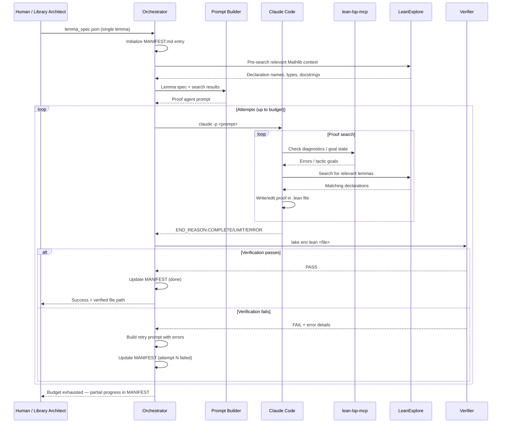

# Proof Oracle — Phase 1 Design Document

## Status: APPROVED — 2026-02-21

---

## 1. Problem Statement

Project Orion's Edge Finder identifies underdeveloped pockets in Mathlib — clusters of missing or thin mathematical infrastructure. But identifying a gap is not the same as filling it. We need a system that can take a pocket candidate (a cluster of absent or under-covered concepts) and produce verified Lean 4 proofs that formalize those concepts into Mathlib-quality lemmas.

This is the Proof Oracle: the second pillar of "Orion the Hunter."

The core challenge is not "can an LLM write Lean code" — it demonstrably can, sometimes. The core challenges are:

1. **Verification correctness** — We must never accept a proof that is unsound, incomplete, or that silently weakens the statement.
2. **Context management** — Claude's context window is finite. Mathlib is enormous. The system must feed the agent only what is relevant.
3. **Structured exploration** — Brute-force prompt-and-pray wastes tokens. The system should guide the agent through a disciplined proof search.
4. **Resumability** — Proof search can take many rounds. Sessions should be interruptible and resumable without losing progress.

---

## 2. Goals and Non-Goals

### Goals (Phase 1 MVP)

- Accept a single lemma specification as input (name, informal statement, suggested Lean signature, and optional proof hints).
- Produce a verified Lean 4 proof of that lemma, confirmed by `lake env lean`.
- Enforce a hard verification gate: no `sorry`, no `axiom`, zero compiler errors.
- Use lean-lsp-mcp for Lean diagnostics and goal states.
- Use LeanExplore MCP for targeted Mathlib search (returning only relevant results).
- Support human-in-the-loop guidance (the user can provide hints and re-run stuck lemmas).
- Produce a proof session log that is inspectable and resumable.
- Target: successfully verify one lemma end-to-end through the full pipeline.

Phase 1 is deliberately scoped to a single lemma. Running the pipeline N times over a pocket is a mechanical extension once the per-lemma pipeline is solid. Solving the hard problem first (getting one lemma right) keeps the feedback loop tight.

### Non-Goals (Phase 1)

- Multi-model orchestration (Gemini + Claude). Phase 1 is Claude-only. See Section 3.3 for the tradeoff analysis.
- Pocket-level orchestration (running multiple lemmas in sequence). This is Phase 1B once the single-lemma pipeline is validated.
- Lemma decomposition from a raw pocket candidate. This belongs to the **Library Architect** (Pillar 3), not the Proof Oracle. The Proof Oracle's input is always a fully-specified single lemma.
- Fully autonomous end-to-end pipeline (Edge Finder → Library Architect → Proof Oracle → PR). Human review remains in the loop for Phase 1.
- Competition-grade theorem proving (Putnam, MiniF2F). Our target is library contribution.
- Parallel proof search across multiple lemmas simultaneously.
- Automatic Mathlib style conformance checking (we will do this manually in Phase 1).
- Handling pockets that require deep metaprogramming or tactic extensions.

---

## 3. Architecture Overview

### 3.1 Design Philosophy: Simplify Numina

The Numina Lean Agent uses a four-agent architecture (Coordinator, Blueprint Agent, Sketch Agent, Proof Agent) with a Python runner managing session lifecycle. This is well-engineered for competition-grade solving of diverse problems.

Our context is simpler:

- We know **what** to prove (Edge Finder output).
- We are filling a **coherent pocket** (related lemmas, not unrelated competition problems).
- We have a **human in the loop** who can provide mathematical guidance.
- We are building **library infrastructure**, not solving contest problems.

Therefore, Phase 1 uses a **two-layer architecture** instead of four agents:

```
┌─────────────────────────────────────────────────────┐
│                   Human Operator                     │
│  (provides lemma spec, reviews output, adds hints)   │
└──────────────────────┬──────────────────────────────┘
                       │ lemma_spec.json (single lemma)
                       ▼
┌─────────────────────────────────────────────────────┐
│               Python Runner (Orchestrator)           │
│                                                      │
│  • Reads single lemma specification                  │
│  • Pre-fetches relevant Mathlib context              │
│  • Spawns Claude Code sessions                       │
│  • Runs verification gate after each session         │
│  • Tracks attempt history in MANIFEST.md             │
│  • Manages attempt budget and retries                │
└──────────────────────┬──────────────────────────────┘
                       │ claude -p <prompt>
                       ▼
┌─────────────────────────────────────────────────────┐
│              Claude Code (Proof Agent)                │
│                                                      │
│  Tools available:                                    │
│  • lean-lsp-mcp  — diagnostics, goal states, types  │
│  • LeanExplore   — search Mathlib declarations       │
│  • File read/write — edit .lean files                │
│                                                      │
│  Constrained:                                        │
│  • No internet access                                │
│  • No arbitrary shell commands                       │
│  • Works in a single .lean file per task             │
└─────────────────────────────────────────────────────┘
```

### 3.2 Why Two Layers, Not Four

| Numina Pattern | Our Adaptation | Rationale |
|---|---|---|
| Coordinator Agent | Python Runner | The coordinator does no Lean work — it is pure orchestration. Python is simpler, more debuggable, and does not consume Claude context. |
| Blueprint Agent | Library Architect (Pillar 3) | Decomposition of a pocket into lemmas is not the Proof Oracle's job. The Library Architect (a separate pillar) takes an Edge Finder pocket and produces a structured lemma plan. The Proof Oracle only executes that plan, one lemma at a time. |
| Sketch Agent | Merged into Proof Agent prompt | For library-grade lemmas with a provided statement, statement formalization is simple enough to include in the proof agent's task prompt. |
| Proof Agent | Claude Code session | Unchanged in spirit. This is where the LLM does Lean proof work. |

**Important architectural clarification on pillar responsibilities:**

The four-pillar flow is:
1. **Edge Finder** — Identifies underdeveloped pockets in Mathlib.
2. **Library Architect** (Pillar 3, future) — Takes a pocket candidate, decomposes it into individual lemmas, determines dependency order, and produces a lemma plan.
3. **Proof Oracle** (this pillar) — Takes one lemma at a time from the Library Architect's plan and produces a verified Lean proof.
4. **Library Expander** (Pillar 4, future) — Assembles verified proofs into a Mathlib PR.

The Proof Oracle has a narrow, well-defined contract: **one lemma specification in, one verified Lean proof out.** It has no knowledge of pockets, dependencies, or the broader Library Architect plan. This keeps the pillar composable and testable.

The key insight from the mathematician's advice: **context management is the critical challenge**. By keeping orchestration in Python and giving Claude Code only the specific tools it needs (lean-lsp-mcp for diagnostics, LeanExplore for search), we minimize context pollution.

### 3.3 Model Choice: Claude

The Proof Oracle is built on **Claude Code** (Anthropic's CLI agent) rather than GPT-4o. This is a practical infrastructure decision, not a raw capability claim.

**The honest picture:**

- No direct GPT-4o vs. Claude head-to-head benchmark on Lean 4 exists in published literature. The COPRA paper (arXiv:2310.04353) built a successful Lean/Coq proof agent on GPT-4 — so GPT-4 class models demonstrably can do this task.
- The gap that matters here is **agentic infrastructure**, not raw reasoning. Claude Code is a first-class agentic CLI with native MCP support. The entire lean-lsp-mcp toolchain was built and documented by Project Numina specifically for Claude Code. Using GPT-4o would require building the same scaffolding from scratch (multi-turn tool loop, process management, MCP wiring).
- Claude Code's Pro subscription (~$20/mo) gives predictable costs for iterative development. The OpenAI API charges per-token; an agentic proof loop with many tool calls could get expensive quickly.

**What we lose by staying Claude-only in Phase 1:**

The main Numina benefit of multi-model is using Gemini as an *informal mathematical advisor* — consulting it for proof sketches at checkpoints, then handing the sketch to Claude for formalization. Without this, the proof agent must do both mathematical reasoning and Lean tactic search in the same context. For library-grade lemmas (short proofs, formulaic structure), this is acceptable. The risk only materializes for hard lemmas with deep induction or non-obvious algebraic structure.

**Mitigation:** The `hints` field in the lemma specification (Section 5.2) is where the human (or a future Gemini call) can inject informal proof guidance. The architecture doesn't need to change to add multi-model later — it's a prompt change, not an infrastructure change.

### 3.4 Orchestrator: Python, Not a Model

The orchestrator is a Python script. It reads files, spawns subprocesses, checks return values, and writes status updates. There is no reasoning task here. Putting an LLM in the orchestration loop would add latency, cost, and a new failure mode (the orchestrator hallucinates a status update) with zero benefit. The Numina team reached the same conclusion. Python determinism is a feature.

---

## 4. Component Breakdown

### 4.1 Python Runner (`proof_oracle/runner/`)

**Responsibility:** Orchestrate proof sessions, manage retries, run verification, track progress.

Core modules:

| Module | Responsibility |
|---|---|
| `orchestrator.py` | Top-level entry point. Reads pocket input, generates task queue, dispatches to session manager. |
| `session.py` | Manages a single Claude Code session: builds prompt, invokes `claude -p`, parses output, handles END_REASON sentinels. |
| `verifier.py` | Hard verification gate. Runs `lake env lean` on target files. Checks for zero errors, zero `sorry`, zero `axiom`. |
| `manifest.py` | Reads/writes MANIFEST.md — the progress tracking file for the pocket. |
| `prompt_builder.py` | Constructs the proof agent prompt from pocket data, lemma specification, and relevant context. |

### 4.2 Proof Agent Prompt (`proof_oracle/prompts/`)

**Responsibility:** Define the system prompt and task prompt templates for the Claude Code proof agent.

The prompt is the most critical design artifact. It must:

1. State the lemma to prove (informal statement + suggested Lean signature).
2. Provide relevant Mathlib context (from LeanExplore search, pre-fetched by the runner).
3. Instruct the agent on its tool usage discipline.
4. Define the proof search strategy (see Section 7).
5. Enforce the sorry-not-axiom policy.
6. Require the END_REASON sentinel on exit.

### 4.3 Verification Gate (`proof_oracle/runner/verifier.py`)

**Responsibility:** The single source of truth for proof correctness.

Adopted directly from Numina's design. This is non-negotiable.

```
Verification Gate Protocol:
1. Run `lake env lean <file.lean>` on every modified .lean file.
2. Parse stdout/stderr for:
   - Compiler errors → FAIL
   - `sorry` in output → FAIL (unless explicitly in allow-list for WIP)
   - `axiom` declarations → FAIL (sorry-not-axiom policy)
3. Return pass/fail + error details.
4. Runner decides: retry (resend prompt with error context) or give up (budget exhausted).
```

Why `lake env lean` and not `lake build`?

- `lake env lean` checks a single file in the project environment (with all Mathlib imports available).
- `lake build` rebuilds the whole project, which is slow and unnecessary for single-file verification.
- This matches Numina's approach and is sufficient for our use case.

### 4.4 MANIFEST.md (Progress Tracker)

**Responsibility:** Human-readable, git-diffable record of pocket progress.

Adapted from Numina's BLUEPRINT.md, but scoped to a single pocket rather than an entire project.

```markdown
# Pocket: Discrete Finite Differences
# Source: edge_finder/runs/investigation/run_2026-02-21_.../candidates.json
# Started: 2026-02-21T16:00:00Z

## Lemma: Finset.sum_shift
- status: done
- file: Orion/Combinatorics/FiniteDifference.lean:15
- attempts: 3/10
- statement: ∑ i in range (n+1), f (i+1) = ∑ i in range (n+1), f i + f (n+1) - f 0
- notes: Used Finset.sum_range_succ twice. Clean proof.

## Lemma: fwdDiff_linear
- status: partial
- file: Orion/Combinatorics/FiniteDifference.lean:28
- attempts: 5/10
- statement: Δ(af + bg) = a(Δf) + b(Δg)
- notes: Stuck on ring_nf not closing. May need explicit cast.
- errors: |
    type mismatch: expected ℤ, got ℕ

## Lemma: sum_by_parts
- status: todo
- file: (not started)
- attempts: 0/10
- statement: ∑ i in range n, f(i) · Δg(i) = f(n)g(n) - f(0)g(0) - ∑ i in range n, g(i+1) · Δf(i)
- notes: Discrete integration by parts. Depends on fwdDiff_linear.
```

Key differences from Numina's BLUEPRINT.md:

- **Scoped to one pocket**, not a whole project. Each pocket run gets its own MANIFEST.md.
- **No `uses` dependency field** in Phase 1. The human manages lemma ordering.
- **Error context included** so the proof agent can learn from previous attempts.

### 4.5 MCP Tool Configuration

Phase 1 requires two MCP servers available to the proof agent:

**lean-lsp-mcp** (from Project Numina):
- Provides: diagnostics, goal states, type information, tactic suggestions.
- Setup: `claude mcp add lean-lsp -- ~/lean-lsp-mcp/numina-lean-mcp.sh`
- This is the agent's "eyes" into Lean — it sees exactly what the Lean compiler sees.

**LeanExplore MCP** (already configured in our project):
- Provides: semantic search over Mathlib declarations.
- Returns: relevant declarations with types and docstrings — only the parts that matter.
- This is the agent's "memory" of Mathlib — it finds relevant lemmas without loading all of Mathlib into context.

Both tools serve the core insight: **give the agent precisely the information it needs, nothing more.** The lean-lsp-mcp gives diagnostics and goal states (what's wrong, what needs to be proved). LeanExplore gives relevant Mathlib declarations (what tools are available). Together, they replace the need for the agent to "know" Mathlib — it can discover what it needs on demand.

---

## 5. Data Flow

### 5.1 End-to-End Flow

The Proof Oracle sits in the middle of the four-pillar pipeline. Its upstream boundary is the Library Architect (which provides a single lemma spec); its downstream boundary is the verified Lean file.

```
[Edge Finder]  →  [Library Architect]  →  [Proof Oracle]  →  [Library Expander]
   (Pillar 1)        (Pillar 3)              (Pillar 2)          (Pillar 4)
                      ↑ future              ↑ this doc             ↑ future

For Phase 1, the human plays the role of Library Architect:
  Human writes lemma_spec.json  →  Proof Oracle  →  verified .lean file
```

Internal flow within the Proof Oracle for a single lemma:

```
Library Architect (or Human)         Proof Oracle                    Lean Project
──────────────────────────           ────────────                    ────────────

lemma_spec.json ──────────┐
                          │
                          ▼
                   ┌──────────────┐
                   │ Orchestrator │
                   └──────┬───────┘
                          │
               ┌──────────┴──────────┐
               ▼                     ▼
        ┌─────────────┐    ┌────────────────┐
        │   Prompt    │    │  Pre-search    │
        │   Builder   │    │ (LeanExplore)  │ ← fetch relevant context
        └──────┬──────┘    └───────┬────────┘
               │                  │
               └──────┬───────────┘
                      ▼
              ┌───────────────┐
              │  Claude Code  │ ← claude -p <proof_prompt>
              │  Proof Agent  │
              │               │──── uses lean-lsp-mcp (diagnostics)
              │               │──── uses LeanExplore (search)
              │               │──── writes/edits .lean file
              └───────┬───────┘
                      │ END_REASON sentinel
                      ▼
              ┌───────────────┐
              │  Verification │ ← lake env lean <file>
              │     Gate      │
              └───────┬───────┘
                      │
                ┌─────┴─────┐
                │           │
              PASS        FAIL
                │           │
                ▼           ▼
           Update      Retry with
           MANIFEST    error context
           (done)      (up to budget)
```

### 5.2 Input Format: Lemma Specification

The orchestrator takes a single lemma specification as input. In Phase 1 this is human-authored (the human plays the Library Architect role). In future phases it will be produced automatically by the Library Architect.

```json
{
  "lemma_name": "fwdDiff_linear",
  "target_file": "Orion/Combinatorics/FiniteDifference.lean",
  "target_namespace": "Orion.Combinatorics.FiniteDifference",
  "informal_statement": "The forward difference operator is linear: Δ(af + bg) = aΔf + bΔg for integer-valued functions on ℕ",
  "suggested_signature": "theorem fwdDiff_linear (a b : ℤ) (f g : ℕ → ℤ) (n : ℕ) : fwdDiff (fun i => a * f i + b * g i) n = a * fwdDiff f n + b * fwdDiff g n",
  "depends_on": ["fwdDiff_def"],
  "hints": "Unfold fwdDiff, then ring.",
  "attempt_budget": 10,
  "difficulty": "easy"
}
```

Fields:
- `lemma_name` — Lean identifier for the lemma.
- `target_file` — Which `.lean` file to write into. If it doesn't exist, the agent creates it with appropriate imports.
- `target_namespace` — Lean namespace to place the lemma in.
- `informal_statement` — Natural language description of what to prove.
- `suggested_signature` — Lean 4 type signature (may need adjustment by the agent).
- `depends_on` — Names of definitions/lemmas this lemma uses. The orchestrator verifies these exist in the file before starting.
- `hints` — Optional informal proof guidance. Can be provided by the human or (in future) by a Gemini advisor call.
- `attempt_budget` — Maximum number of Claude Code session invocations.
- `difficulty` — `trivial` / `easy` / `medium` / `hard`. Used to set default budget if not specified.

### 5.3 Output Format

The Proof Oracle produces:

1. **A verified Lean file** (or appended content to an existing file) with the proof in place.
2. **Updated MANIFEST.md** recording the attempt history and final status.
3. **Session log** (raw Claude Code stdout for each attempt, stored in `proof_oracle/runs/<run_id>/`).

The output is deliberately minimal. The Proof Oracle does not manage pockets, dependencies, or PRs — those are other pillars' responsibilities.
---

## 6. Verification Gate Design

This is the most critical subsystem. It is adopted from Numina with minimal changes.

### 6.1 Invariants (Non-Negotiable)

1. **No proof is accepted without passing `lake env lean`.** The agent's self-report ("I believe this is correct") is never trusted.
2. **`sorry` means incomplete.** Any `sorry` in the output means the proof has gaps. The sorry-not-axiom policy ensures gaps are visible.
3. **`axiom` is forbidden.** An `axiom` declaration would silently pass the compiler but introduce an unsound assumption. The verification gate scans for this.
4. **Statement integrity.** The lemma statement in the final .lean file must match the intended specification. Phase 1 enforces this via human review; future phases could use statement hashing (like Numina's StatementTracker).

### 6.2 Verification Flow

```python
def verify(lean_file: Path, project_root: Path) -> VerificationResult:
    """
    Run lake env lean on a file. Return pass/fail with details.
    """
    result = subprocess.run(
        ["lake", "env", "lean", str(lean_file)],
        cwd=project_root,
        capture_output=True, text=True, timeout=300
    )

    errors = parse_lean_errors(result.stderr)
    has_sorry = "declaration uses 'sorry'" in result.stderr
    has_axiom = scan_for_axiom_declarations(lean_file)

    return VerificationResult(
        passed=len(errors) == 0 and not has_sorry and not has_axiom,
        errors=errors,
        has_sorry=has_sorry,
        has_axiom=has_axiom,
        raw_stderr=result.stderr
    )
```

### 6.3 Retry Protocol

When verification fails:

1. Parse the error output.
2. Construct a retry prompt: original task + "Your previous attempt had these errors: ..." + the error details.
3. Spawn a **new** Claude Code session (fresh context) with the retry prompt.
4. Repeat until the attempt budget is exhausted.

Why new sessions for retries (not continuations)?

- Fresh context prevents error-fixing loops from filling the context window.
- The retry prompt includes only the essential information: the task + what went wrong.
- This matches the mathematician's insight: "the minute the context flushes, the whole thing gets messed up."

---

## 7. Proof Search Strategy

The proof agent needs a disciplined search strategy, not random guessing. Phase 1 uses a simplified version of Numina's multi-method approach.

### 7.1 Method Hierarchy

The proof agent prompt instructs it to try methods in this order:

1. **Direct tactic proof.** Try `simp`, `ring`, `omega`, `decide`, `norm_num`, or a short tactic chain. Many library lemmas are simple consequences of existing automation.

2. **Search-and-apply.** Use LeanExplore to find relevant existing lemmas, then apply/rewrite with them. This is the bread-and-butter of Mathlib contribution — most new lemmas follow from existing ones with minor glue.

3. **Term-mode proof.** For simple definitional equalities or direct constructions, write an explicit term.

4. **Structured tactic proof.** For multi-step proofs: `calc` blocks, `have` / `suffices` intermediate goals, `induction`, `cases`. Use lean-lsp-mcp to inspect goal state after each step.

5. **Fallback: simplify and report.** If all methods fail within the budget, simplify the goal as far as possible, report remaining obligations, and exit with `END_REASON:LIMIT`.

### 7.2 Attempt Budget

Each lemma gets an attempt budget (default: 10 attempts). One "attempt" is one Claude Code session invocation. The budget is configurable per-lemma in the pocket specification.

Budget allocation guidance:

| Lemma Type | Default Budget | Rationale |
|---|---|---|
| Definitions (`def`, `abbrev`) | 5 | Should succeed on first try; budget is for import/type errors. |
| Simple lemmas (1-2 step proofs) | 10 | May need a few iterations to find the right lemma name or tactic. |
| Medium lemmas (3-5 step proofs) | 15 | Structured proofs may need multiple rounds of goal-state inspection. |
| Hard lemmas (6+ steps, induction) | 20 | Complex proofs benefit from more exploration. |

### 7.3 Context Seeding

Before spawning the proof agent, the orchestrator pre-fetches relevant Mathlib context using LeanExplore:

1. Search for the concept name (e.g., "forward difference", "Finset.sum").
2. Search for related infrastructure identified by Edge Finder (e.g., "Finset.sum_range_succ").
3. Include the search results (declaration names, types, docstrings) in the proof agent prompt.

This gives the agent a "warm start" — it knows which Mathlib tools are available before it begins. The agent can also search independently during the session via its LeanExplore MCP access.

---

## 8. Session Lifecycle

### 8.1 Single Lemma Session

```
Orchestrator                    Claude Code Session
────────────                    ───────────────────

1. Build prompt                  
   (lemma spec +                 
    pre-searched context +       
    proof strategy instructions)
                                 
2. Invoke: claude -p <prompt>    
   --permission-mode bypass   →  3. Agent starts
                                    • Reads prompt
                                    • Creates/opens .lean file
                                    • Writes import + statement
                                    • Checks with lean-lsp-mcp
                                    
                                 4. Proof search loop:
                                    • Try method from hierarchy
                                    • Check diagnostics via LSP
                                    • If errors, adjust and retry
                                    • If stuck, search via LeanExplore
                                    • Repeat until proof compiles
                                    or attempts exhausted
                                    
                              ←  5. Agent exits with END_REASON
                                    • COMPLETE: "I believe proof is done"
                                    • LIMIT: "Ran out of context/ideas"

6. Parse END_REASON              
7. Run verification gate         
   (lake env lean <file>)        
                                 
8a. If PASS:                     
    Update MANIFEST (done)       
    Move to next lemma           
                                 
8b. If FAIL:                     
    If budget remaining:         
      Build retry prompt         
      Go to step 2               
    Else:                        
      Update MANIFEST (failed)   
      Move to next lemma         
```

### 8.2 Pocket-Level Session (Phase 1B Extension)

Once the single-lemma pipeline is validated, extending to a pocket is straightforward: the orchestrator iterates over a list of lemma specs (provided by the Library Architect) and runs the single-lemma pipeline for each in dependency order.

```
For each lemma in pocket plan (in dependency order):
  1. Run single-lemma session (Section 8.1)
  2. If lemma fails all attempts:
     - Insert `sorry`-stubbed version of the lemma
     - Mark as "blocked" in MANIFEST
     - Continue to next lemma (dependents may still partially work)
3. Report summary to human / Library Architect
```

This is not implemented in Phase 1. It is noted here to confirm the single-lemma design is already shaped for this extension.

### 8.3 END_REASON Sentinel Protocol

Adopted from Numina. The proof agent must output exactly one of these lines before exiting:

```
END_REASON:COMPLETE    — Agent believes the proof compiles with no sorry.
END_REASON:LIMIT       — Agent exhausted its context or search budget.
END_REASON:ERROR       — Agent encountered an unrecoverable error (e.g., import failure).
```

The orchestrator parses stdout with the regex: `(?m)^\s*END_REASON:(COMPLETE|LIMIT|ERROR)\s*$`

If no sentinel is found, the orchestrator treats it as an implicit `LIMIT` and retries.

---

## 9. What Phase 1 MVP Looks Like

### 9.1 Concrete Deliverables

1. **`proof_oracle/runner/`** — Python package with orchestrator, session manager, verifier, manifest manager, prompt builder. Estimated ~400-600 lines.

2. **`proof_oracle/prompts/`** — Proof agent system prompt and task prompt templates. Estimated ~100-200 lines of markdown/text.

3. **`proof_oracle/runs/`** — Session logs directory (gitignored).

4. **`proof_oracle/docs/`** — This design doc + a walkthrough doc after implementation.

5. **A working proof of the system:** Successfully verify a single lemma end-to-end through the full pipeline (runner → Claude Code → verification gate). The target is `fwdDiff_linear` from the discrete finite differences pocket.

### 9.2 Target Lemma: `fwdDiff_linear`

Why this lemma:

- Not trivial (it requires unfolding a definition and closing with `ring`), so it exercises the full proof search loop.
- Not too hard (one or two steps), so it won't exhaust budgets on the first run.
- Depends on a definition (`fwdDiff`) that is simple enough to write manually upfront in the file, so the agent doesn't have to solve a dependency problem.
- Connects to the discrete finite differences pocket identified as a genuine Mathlib gap.

The lemma to prove:

```lean
-- Definition (written manually, not by the agent)
def fwdDiff (f : ℕ → ℤ) (n : ℕ) : ℤ := f (n + 1) - f n

-- Target lemma (agent proves this)
theorem fwdDiff_linear (a b : ℤ) (f g : ℕ → ℤ) (n : ℕ) :
    fwdDiff (fun i => a * f i + b * g i) n = a * fwdDiff f n + b * fwdDiff g n := by
  simp [fwdDiff]
  ring
```

The expected proof is `simp [fwdDiff]; ring` — easy enough to succeed on first or second attempt, but requires the agent to correctly unfold the definition and recognize a ring identity.

### 9.3 Candidate Lemmas for Phase 1B (Pocket Extension)

Once the single-lemma pipeline is validated, these are the natural next lemmas for the discrete finite differences pocket:

| # | Name | Statement (Informal) | Expected Difficulty |
|---|---|---|---|
| 1 | `fwdDiff` | Definition: Δf(n) = f(n+1) - f(n) | Trivial (def) |
| 2 | `fwdDiff_linear` | Δ(af + bg) = aΔf + bΔg | Easy (ring) — **Phase 1 target** |
| 3 | `fwdDiff_const` | Δc = 0 where c is constant | Easy (simp) |
| 4 | `fwdDiff_id` | Δ(id) = 1 (where id(n) = n) | Easy (ring) |
| 5 | `telescoping_sum` | ∑_{i=0}^{n-1} Δf(i) = f(n) - f(0) | Medium (induction + Finset) |
| 6 | `sum_by_parts` | Discrete summation by parts formula | Medium-Hard (algebraic) |

### 9.4 Success Criteria

Phase 1 is successful if:

- The pipeline runs `fwdDiff_linear` end-to-end: runner invokes Claude Code, agent writes a proof, verification gate checks it, result is logged in MANIFEST.md.
- The verification gate correctly rejects a proof with `sorry` or compiler errors.
- The verification gate correctly accepts a clean proof.
- The system can be re-run on a different lemma spec without code changes.
- The human can add a hint to the spec and re-run to help a stuck agent.

---

## 10. Comparison with Numina

| Aspect | Numina Lean Agent | Proof Oracle Phase 1 |
|---|---|---|
| **Purpose** | Competition theorem proving | Mathlib library contribution |
| **Input granularity** | Full project BLUEPRINT.md | Single lemma specification |
| **Agent count** | 4 (Coordinator, Blueprint, Sketch, Proof) | 1 (Proof Agent) + Python orchestrator |
| **Orchestration** | Claude Code coordinator agent | Python script |
| **Lemma decomposition** | Blueprint Agent | Library Architect (separate pillar, not Proof Oracle) |
| **Problem source** | BLUEPRINT.md (human-authored) | lemma_spec.json (from Library Architect or human) |
| **Models** | Claude + Gemini | Claude only |
| **Informal math advisor** | Gemini at checkpoints | Human hints field (extensible to Gemini in Phase 2) |
| **Verification** | `lake env lean` + sorry scan | Same (adopted directly) |
| **Sorry policy** | sorry-not-axiom | Same (adopted directly) |
| **Session management** | Python runner with END_REASON | Same (adopted directly) |
| **Context strategy** | Subagent isolation | Single-agent fresh sessions + MCP tools |
| **Progress tracking** | BLUEPRINT.md (project-wide) | MANIFEST.md (per-lemma attempt history) |
| **Retry strategy** | Same session continuation + new session | New session only (simpler, cleaner context) |
| **Mathlib search** | lean-lsp-mcp tools | lean-lsp-mcp + LeanExplore MCP |

---

## 11. Tool Integration Plan

### 11.1 lean-lsp-mcp Setup

**Required:** Install from `https://github.com/project-numina/lean-lsp-mcp`.

Configuration for Claude Code:
```bash
claude mcp add lean-lsp -- ~/lean-lsp-mcp/numina-lean-mcp.sh
```

This MCP server must be directory-scoped to our project root (`project_orion/`) so it picks up the correct `lakefile.toml` and Mathlib dependencies.

Key tools provided:
- `lean_goal` — Get the current goal state at a `sorry` or `_` position.
- `leandex` — Get type/docstring of a declaration.
- `lean_diagnostics` — Get compiler errors/warnings for a file.

### 11.2 LeanExplore MCP

**Already configured** in `opencode.jsonc` as `lean_explore`.

For Claude Code sessions, we need to add it to Claude's MCP config:
```bash
claude mcp add lean-explore -- lean-explore mcp serve
```

Key tools provided:
- `search` — Semantic search over Mathlib declarations. Returns names, types, docstrings.
- `search_summary` — Returns a condensed summary of search results (critical for context management).

### 11.3 Claude Code Invocation

The orchestrator invokes Claude Code with:
```bash
claude -p <prompt_file> \
  --permission-mode bypassPermissions \
  --max-tokens <budget>
```

Flags:
- `-p` — Non-interactive mode, reads prompt from argument or stdin.
- `--permission-mode bypassPermissions` — Allows file writes without confirmation (needed for autonomous operation).
- `--max-tokens` — Limits output to prevent runaway generation.

### 11.4 Tool Access Constraints

The proof agent should **not** have access to:
- Internet/web browsing (all information comes from lean-lsp-mcp and LeanExplore).
- Arbitrary shell commands (prevents accidental `lake build` or other slow operations).
- Other project files outside the target .lean file and MANIFEST.md.

This follows the mathematician's advice: constrain what tools Claude can use to prevent context pollution.

---

## 12. Risk Analysis

### 12.1 Known Risks

| Risk | Severity | Mitigation |
|---|---|---|
| **lean-lsp-mcp instability** | High | Test MCP setup thoroughly before building runner. Have fallback: agent can use `#check` and `#print` commands in Lean directly. |
| **LeanExplore API errors** | Medium | Already observed 500 errors during Edge Finder investigation. Build retry logic + cache results. Pre-fetch context reduces dependency on live search during proof. |
| **Context window exhaustion** | High | Fresh session per retry (not continuation). Pre-seed only relevant context. Keep proof agent prompts under 4K tokens. |
| **Proof agent hallucinating lemma names** | High | lean-lsp-mcp diagnostics will catch "unknown identifier" errors immediately. LeanExplore gives real names. Verification gate is the final backstop. |
| **Statement drift** | Medium | The proof agent might subtly weaken a lemma to make it provable (e.g., adding unnecessary hypotheses). Phase 1 mitigation: human review of all output. Phase 2: automated statement hash checking. |
| **Slow verification** | Medium | First `lake env lean` invocation must compile Mathlib imports (slow). Subsequent invocations use cache. Mitigate: warm the cache once before starting a session. |
| **Dependency ordering failures** | Low | If lemma B depends on lemma A, and A failed, B may also fail. Mitigate: the orchestrator processes lemmas in dependency order and inserts sorry stubs for failed dependencies. |

### 12.2 Open Questions

1. **How should we handle Lean imports?** Should each lemma get its own file, or should the pocket be a single file? Single file is simpler but means the agent sees all previous lemmas in context. Multiple files means managing import dependencies.

   **Current lean:** Single file per pocket for Phase 1. Simpler, and the agent can reference earlier lemmas directly.

2. **Should the pre-search step be in the orchestrator or the agent?** The orchestrator can pre-fetch LeanExplore results and include them in the prompt, or the agent can search on its own.

   **Current lean:** Both. The orchestrator pre-fetches a "starter context" (5-10 most relevant declarations), and the agent can search for more during proof.

3. **How do we handle Mathlib import management?** The .lean file needs the right imports. Should we provide a standard import block, or let the agent figure it out?

   **Current lean:** Provide a standard import block in the prompt (e.g., `import Mathlib`). This is heavy but reliable. We can optimize later with targeted imports.

4. **What is the right attempt budget?** Too low means giving up too early. Too high means wasting tokens on impossible lemmas.

   **Current lean:** Start with the budget table in Section 7.2 and calibrate based on Phase 1 results.

5. **Should the runner support a "human hint" mid-run?** If a lemma is stuck after N attempts, can the human inject a hint and resume?

   **Current lean:** Yes, this is valuable. The human edits the pocket_spec.json `hints` field and re-runs the stuck lemma. No special infrastructure needed — just re-invoke the orchestrator for that lemma.

---

## 13. Implementation Plan

### Phase 1A: Infrastructure (Build the Runner)

1. Set up lean-lsp-mcp and verify it works with our project.
2. Set up LeanExplore MCP for Claude Code and verify it works.
3. Implement `verifier.py` (verification gate) — test independently with a known-good and known-bad .lean file.
4. Implement `session.py` (Claude Code session manager) — test with a trivial proof task.
5. Implement `manifest.py` (MANIFEST.md reader/writer).
6. Implement `prompt_builder.py` (proof agent prompt construction).
7. Implement `orchestrator.py` (tie it all together for single-lemma input).

### Phase 1B: Proof Agent Prompt (Write the Prompt)

1. Draft the proof agent system prompt.
2. Draft the task prompt template.
3. Test with the `fwdDiff_linear` lemma.
4. Iterate on prompt based on agent behavior.

### Phase 1C: Validation (Prove the Target Lemma)

1. Write `lemma_specs/fwdDiff_linear.json`.
2. Run the full pipeline end-to-end.
3. Debug, iterate, adjust budgets and prompts.
4. Confirm the verification gate correctly rejects and accepts.
5. Write the ownership transfer walkthrough doc.

### Estimated Effort

- Phase 1A: ~2-3 sessions (runner infrastructure)
- Phase 1B: ~1-2 sessions (prompt engineering)
- Phase 1C: ~1-2 sessions (running and validating one lemma)
- Total: ~4-7 sessions

---

## 14. Future Phases (Not In Scope)

For context on where this is heading, but explicitly not part of Phase 1:

- **Phase 1B:** Pocket-level orchestration — run the single-lemma pipeline N times in dependency order over a Library Architect plan. MANIFEST.md tracks the full pocket. Minimal new code (the single-lemma loop is already parameterized).
- **Phase 2:** Automated lemma spec generation from Library Architect output. Statement integrity checking (automated hash comparison). Retry with Gemini-generated informal proof hints on hard lemmas.
- **Phase 3:** Automated Mathlib style checking. Multi-lemma parallelism where dependency graph allows it.
- **Phase 4:** Integration with Library Expander (Pillar 4) for automated PR generation from verified pocket files.

---

## 15. Sequence Diagram



---

## 16. Directory Structure

```
proof_oracle/
├── docs/
│   ├── proof_oracle_design.md      # This document
│   └── proof_oracle_walkthrough.md # After implementation (Phase 3 per AGENTS.md)
├── prompts/
│   ├── system_prompt.md            # Proof agent system prompt
│   └── task_template.md            # Per-lemma task prompt template
├── runner/
│   ├── __init__.py
│   ├── orchestrator.py             # Top-level entry point (single lemma)
│   ├── session.py                  # Claude Code session management
│   ├── verifier.py                 # Hard verification gate
│   ├── manifest.py                 # MANIFEST.md reader/writer
│   └── prompt_builder.py           # Prompt construction
├── runs/                           # Session logs (gitignored)
└── lemma_specs/                    # Individual lemma specification files
    └── fwdDiff_linear.json         # Phase 1 target lemma
```

Note: there is no `pocket_specs/` directory in Phase 1. Pocket-level orchestration is Phase 1B. The input unit is a single lemma spec.
